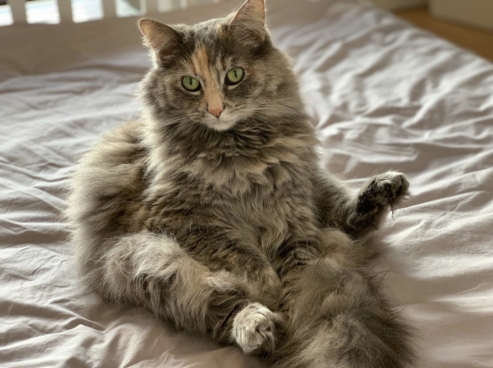
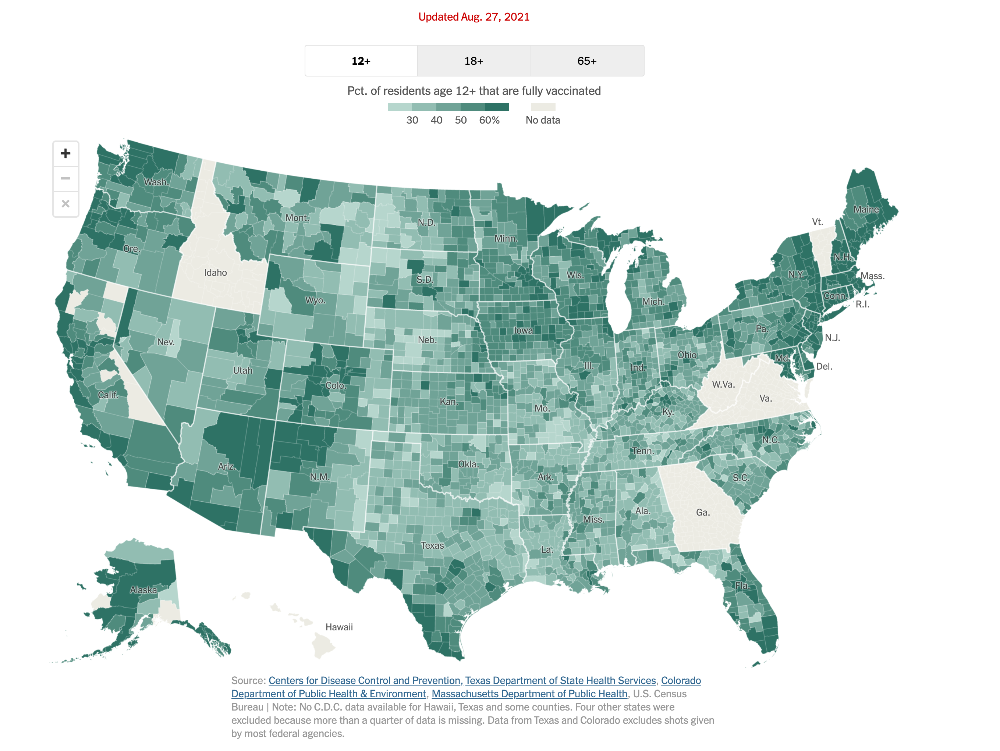
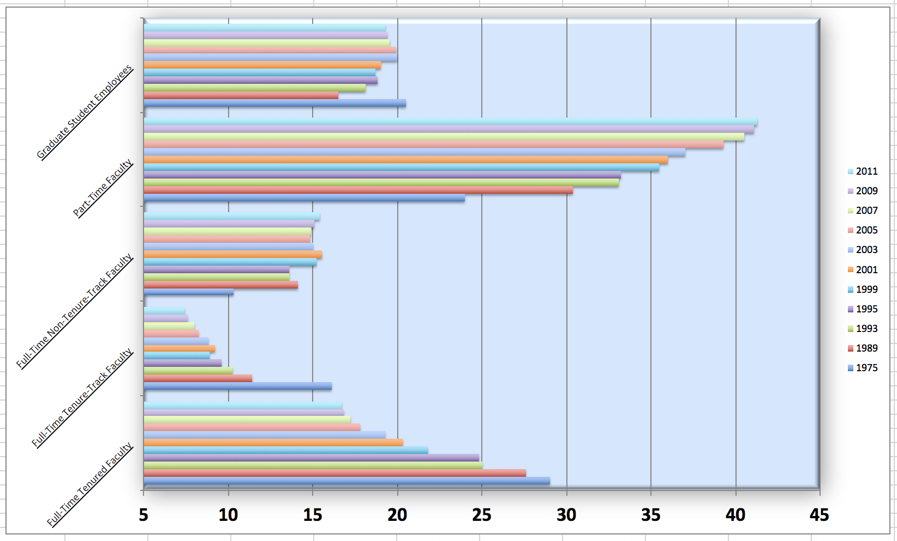

```{r setup, include=FALSE}
options(htmltools.dir.version = FALSE)
knitr::opts_chunk$set(
  fig.width = 8, fig.asp = 0.618, fig.retina = 3, dpi = 300,
  out.width = "60%",
  cache = FALSE,
  echo = TRUE,
  message = FALSE, 
  warning = FALSE,
  hiline = TRUE
)

xaringanExtra::use_panelset()
ggplot2::theme_set(ggplot2::theme_gray(base_size = 16))
```

```{r xaringan-themer, include = FALSE, warning = FALSE}
library(xaringanthemer)
style_duo_accent(
  primary_color = "#866fa3",
  secondary_color = "#F1DE67",
  inverse_header_color = "#464a53",
  black_color = "#464a53",
  code_highlight_color = "#f1de67",
  header_font_google = google_font("Atkinson Hyperlegible"),
  text_font_google   = google_font("Atkinson Hyperlegible", "300", "300i"),
  code_font_google   = google_font("Source Code Pro"),
  code_font_size = "20px",
  title_slide_background_color = "#FFFFFF",
  title_slide_background_image = "https://github.com/vizdata-f21/slides/raw/main/vizdata-bg.jpeg",
  title_slide_background_size = "contain",
  base_font_size = "24px",
  header_h1_font_size = "2rem",
  header_h2_font_size = "1.75rem",
  header_h3_font_size = "1.5rem",
  extra_css = list(
    "h1" = list("margin-block-start" = "0.4rem", 
                 "margin-block-end" = "0.4rem"),
    "h2" = list("margin-block-start" = "0.4rem", 
                 "margin-block-end" = "0.4rem"),
    "h3" = list("margin-block-start" = "0.4rem", 
                 "margin-block-end" = "0.4rem"),
    ".small" = list("font-size" = "90%"),
    ".midi" = list("font-size" = "85%"),
    ".large" = list("font-size" = "200%"),
    ".xlarge" = list("font-size" = "600%"),
    ".hand" = list("font-family" = "'Gochi Hand', cursive",
                   "font-size" = "125%"),
    ".task" = list("padding-right"    = "10px",
                   "padding-left"     = "10px",
                   "padding-top"      = "3px",
                   "padding-bottom"   = "3px",
                   "margin-bottom"    = "6px",
                   "margin-top"       = "6px",
                   "border-left"      = "solid 5px #F1DE67",
                   "background-color" = "#F1DE6750"),
    ".pull-left" = list("width" = "49%",
                        "float" = "left"),
    ".pull-right" = list("width" = "49%",
                         "float" = "right"),
    ".pull-left-wide" = list("width" = "70%",
                             "float" = "left"),
    ".pull-right-narrow" = list("width" = "27%",
                                "float" = "right"),
    ".pull-left-narrow" = list("width" = "27%",
                               "float" = "left"),
    ".pull-right-wide" = list("width" = "70%",
                              "float" = "right") 
    )
  )
```

class: middle, inverse

# Announcements

---

## Announcements

- If you cannot be in class any day due to COVID isolation, file an [incapacitation form](https://trinity.duke.edu/undergraduate/academic-policies/illness) regardless of due dates.

- For those on the waitlist, we're not allowed to add seats to the class due to fire code.

- Before Monday: Fill out "Getting to know you" survey.

- Before Wednesday: Complete reading + first reading quiz (to be posted on course website).

---

## Dorianne Gray

```{r echo=FALSE, out.width = "70%", fig.align = "center"}

```


---

class: middle, inverse

# Data visualization

---

## Data visualization

> *"The simple graph has brought more information to the data analyst's mind than any other device." --- John Tukey*

- Data visualization is the creation and study of the visual representation of data
- Many tools for visualizing data -- R is one of them
- Many approaches/systems within R for making data visualizations -- **ggplot2** is one of them, and that's what we're going to use

---

## ggplot2 $\in$ tidyverse

.pull-left[
```{r echo=FALSE, out.width="80%"}
knitr::include_graphics("images/ggplot2-part-of-tidyverse.png")
```
] 
.pull-right[ 
- **ggplot2** is tidyverse's data visualization package 
- `gg` in "ggplot2" stands for Grammar of Graphics 
- Inspired by the book **Grammar of Graphics** by Leland Wilkinson
]

---

## Grammar of Graphics

.pull-left-narrow[
A grammar of graphics is a tool that enables us to concisely describe the components of a graphic
]
.pull-right-wide[
```{r echo=FALSE, out.width="90%"}
knitr::include_graphics("images/grammar-of-graphics.png")
```
]

.footnote[
Source: [BloggoType](http://bloggotype.blogspot.com/2016/08/holiday-notes2-grammar-of-graphics.html)
]

---

## Hello ggplot2!

.pull-left-wide[
- `ggplot()` is the main function in ggplot2
- Plots are constructed in layers
- Structure of the code for plots can be summarized as

```{r eval = FALSE}
ggplot(data = [dataset], 
       mapping = aes(x = [x-variable], y = [y-variable])) +
   geom_xxx() +
   other options
```

- The ggplot2 package comes with the tidyverse

```{r}
library(tidyverse)
```

- For help with ggplot2, see [ggplot2.tidyverse.org](http://ggplot2.tidyverse.org/)
]

---

class: middle, inverse

# Why do we visualize?

---

## Why do we visualize? 

1. Discover patterns that may not be obvious from numerical summaries


---

## Anscombe's quartet

```{r quartet-for-show, results = "hide"}
library(Tmisc)
quartet %>% slice_head(n = 15)
```

---

## Summary statistics for Anscombe's quartet

```{r quartet-summary}
quartet %>%
  group_by(set) %>%
  summarise(
    mean_x = mean(x), 
    mean_y = mean(y),
    sd_x = sd(x),
    sd_y = sd(y),
    r = cor(x, y)
  )
```

---

## Scatterplots for Anscombe's quartet

```{r quartet-plot, echo = FALSE, out.width = "100%", fig.asp = 0.4}
ggplot(quartet, aes(x = x, y = y)) +
  geom_point() +
  facet_wrap(~ set, ncol = 4)
```

---

## Why do we visualize? 

1. Discover patterns that may not be obvious from numerical summaries

2. Convey information in a way that is otherwise difficult/impossible to convey

---

## Excess deaths due to COVID-19

```{r echo = FALSE, fig.align = "center"}
knitr::include_graphics("images/ft-covid-excess-deaths.png")
```

.footnote[
Source: [Financial Times](https://www.ft.com/content/a2901ce8-5eb7-4633-b89c-cbdf5b386938), 27 Aug 2021.
]

---

## COVID-19 vaccination in US Counties

```{r echo = FALSE, fig.align = "center"}

```

.footnote[
Source: [New York Times](https://www.nytimes.com/interactive/2020/us/covid-19-vaccine-doses.html), 27 Aug 2021.
]

---

class: middle, inverse

# ggplot2 `r emo::ji("heart")` `r emo::ji("penguin")`

---

## ggplot2 $\in$ tidyverse

.pull-left[
```{r echo=FALSE, out.width="80%"}
knitr::include_graphics("images/ggplot2-part-of-tidyverse.png")
```
] 
.pull-right[ 
- **ggplot2** is tidyverse's data visualization package 
- Structure of the code for plots can be summarized as

```{r eval = FALSE}
ggplot(data = [dataset], 
       mapping = aes(x = [x-variable], 
                     y = [y-variable])) +
   geom_xxx() +
   other options
```
]

---

## Data: Palmer Penguins

Measurements for penguin species, island in Palmer Archipelago, size (flipper length, body mass, bill dimensions), and sex.

.pull-left-narrow[
```{r echo=FALSE, out.width="80%"}
knitr::include_graphics("images/penguins.png")
```
]
.pull-right-wide[
```{r}
library(palmerpenguins)
glimpse(penguins)
```
]

---

.panelset[
.panel[.panel-name[Plot]
```{r ref.label = "penguins", echo = FALSE, warning = FALSE, out.width = "70%", fig.width = 8}
```
]
.panel[.panel-name[Code]

```{r penguins, fig.show = "hide"}
ggplot(data = penguins, 
       mapping = aes(x = bill_depth_mm, y = bill_length_mm,
                     colour = species)) +
  geom_point() +
  labs(title = "Bill depth and length",
       subtitle = "Dimensions for Adelie, Chinstrap, and Gentoo Penguins",
       x = "Bill depth (mm)", y = "Bill length (mm)",
       colour = "Species")
```
]
]

---

class: middle, inverse

# Coding out loud

---

.midi[
> **Start with the `penguins` data frame**
]

.pull-left[
```{r penguins-0, fig.show = "hide", warning = FALSE}
ggplot(data = penguins) #<<
```
]
.pull-right[
```{r ref.label = "penguins-0", echo = FALSE, warning = FALSE, out.width = "100%", fig.width = 8}
```
]

---

.midi[
> Start with the `penguins` data frame,
> **map bill depth to the x-axis**
]

.pull-left[
```{r penguins-1, fig.show = "hide", warning = FALSE}
ggplot(data = penguins,
       mapping = aes(x = bill_depth_mm)) #<<
```
]
.pull-right[
```{r ref.label = "penguins-1", echo = FALSE, warning = FALSE, out.width = "100%", fig.width = 8}
```
]

---

.midi[
> Start with the `penguins` data frame,
> map bill depth to the x-axis
> **and map bill length to the y-axis.**
]

.pull-left[
```{r penguins-2, fig.show = "hide", warning = FALSE}
ggplot(data = penguins,
       mapping = aes(x = bill_depth_mm,
                     y = bill_length_mm)) #<<
```
]
.pull-right[
```{r ref.label = "penguins-2", echo = FALSE, warning = FALSE, out.width = "100%", fig.width = 8}
```
]

---

.midi[
> Start with the `penguins` data frame,
> map bill depth to the x-axis
> and map bill length to the y-axis. 
> **Represent each observation with a point**
]

.pull-left[
```{r penguins-3, fig.show = "hide", warning = FALSE}
ggplot(data = penguins,
       mapping = aes(x = bill_depth_mm,
                     y = bill_length_mm)) + 
  geom_point() #<<
```
]
.pull-right[
```{r ref.label = "penguins-3", echo = FALSE, warning = FALSE, out.width = "100%", fig.width = 8}
```
]

---

.midi[
> Start with the `penguins` data frame,
> map bill depth to the x-axis
> and map bill length to the y-axis. 
> Represent each observation with a point
> **and map species to the colour of each point.**
]

.pull-left[
```{r penguins-4, fig.show = "hide", warning = FALSE}
ggplot(data = penguins,
       mapping = aes(x = bill_depth_mm,
                     y = bill_length_mm,
                     colour = species)) + #<<
  geom_point()
```
]
.pull-right[
```{r ref.label = "penguins-4", echo = FALSE, warning = FALSE, out.width = "100%", fig.width = 8}
```
]

---

.midi[
> Start with the `penguins` data frame,
> map bill depth to the x-axis
> and map bill length to the y-axis. 
> Represent each observation with a point
> and map species to the colour of each point.
> **Title the plot "Bill depth and length"**
]

.pull-left[
```{r penguins-5, fig.show = "hide", warning = FALSE}
ggplot(data = penguins,
       mapping = aes(x = bill_depth_mm,
                     y = bill_length_mm,
                     colour = species)) +
  geom_point() +
  labs(title = "Bill depth and length") #<<
```
]
.pull-right[
```{r ref.label = "penguins-5", echo = FALSE, warning = FALSE, out.width = "100%", fig.width = 8}
```
]

---

.midi[
> Start with the `penguins` data frame,
> map bill depth to the x-axis
> and map bill length to the y-axis. 
> Represent each observation with a point
> and map species to the colour of each point.
> Title the plot "Bill depth and length", 
> **add the subtitle "Dimensions for Adelie, Chinstrap, and Gentoo Penguins"**
]

.pull-left[
```{r penguins-6, fig.show = "hide", warning = FALSE}
ggplot(data = penguins,
       mapping = aes(x = bill_depth_mm,
                     y = bill_length_mm,
                     colour = species)) +
  geom_point() +
  labs(title = "Bill depth and length",
       subtitle = "Dimensions for Adelie, Chinstrap, and Gentoo Penguins") #<<
```
]
.pull-right[
```{r ref.label = "penguins-6", echo = FALSE, warning = FALSE, out.width = "100%", fig.width = 8}
```
]

---

.midi[
> Start with the `penguins` data frame,
> map bill depth to the x-axis
> and map bill length to the y-axis. 
> Represent each observation with a point
> and map species to the colour of each point.
> Title the plot "Bill depth and length", 
> add the subtitle "Dimensions for Adelie, Chinstrap, and Gentoo Penguins", 
> **label the x and y axes as "Bill depth (mm)" and "Bill length (mm)", respectively**
]

.pull-left[
```{r penguins-7, fig.show = "hide", warning = FALSE}
ggplot(data = penguins,
       mapping = aes(x = bill_depth_mm,
                     y = bill_length_mm,
                     colour = species)) +
  geom_point() +
  labs(title = "Bill depth and length",
       subtitle = "Dimensions for Adelie, Chinstrap, and Gentoo Penguins",
       x = "Bill depth (mm)", y = "Bill length (mm)") #<<
```
]
.pull-right[
```{r ref.label = "penguins-7", echo = FALSE, warning = FALSE, out.width = "100%", fig.width = 8}
```
]

---

.midi[
> Start with the `penguins` data frame,
> map bill depth to the x-axis
> and map bill length to the y-axis. 
> Represent each observation with a point
> and map species to the colour of each point.
> Title the plot "Bill depth and length", 
> add the subtitle "Dimensions for Adelie, Chinstrap, and Gentoo Penguins", 
> label the x and y axes as "Bill depth (mm)" and "Bill length (mm)", respectively,
> **label the legend "Species"**
]

.pull-left[
```{r penguins-8, fig.show = "hide", warning = FALSE}
ggplot(data = penguins,
       mapping = aes(x = bill_depth_mm,
                     y = bill_length_mm,
                     colour = species)) +
  geom_point() +
  labs(title = "Bill depth and length",
       subtitle = "Dimensions for Adelie, Chinstrap, and Gentoo Penguins",
       x = "Bill depth (mm)", y = "Bill length (mm)",
       colour = "Species") #<<
```
]
.pull-right[
```{r ref.label = "penguins-8", echo = FALSE, warning = FALSE, out.width = "100%", fig.width = 8}
```
]

---

.midi[
> Start with the `penguins` data frame,
> map bill depth to the x-axis
> and map bill length to the y-axis. 
> Represent each observation with a point
> and map species to the colour of each point.
> Title the plot "Bill depth and length", 
> add the subtitle "Dimensions for Adelie, Chinstrap, and Gentoo Penguins", 
> label the x and y axes as "Bill depth (mm)" and "Bill length (mm)", respectively,
> label the legend "Species", 
> **and add a caption for the data source.**
]

.pull-left[
```{r penguins-9, fig.show = "hide", warning = FALSE}
ggplot(data = penguins,
       mapping = aes(x = bill_depth_mm,
                     y = bill_length_mm,
                     colour = species)) +
  geom_point() +
  labs(title = "Bill depth and length",
       subtitle = "Dimensions for Adelie, Chinstrap, and Gentoo Penguins",
       x = "Bill depth (mm)", y = "Bill length (mm)",
       colour = "Species",
       caption = "Source: Palmer Station LTER / palmerpenguins package") #<<
```
]
.pull-right[
```{r ref.label = "penguins-9", echo = FALSE, warning = FALSE, out.width = "100%", fig.width = 8}
```
]

---

.midi[
> Start with the `penguins` data frame,
> map bill depth to the x-axis
> and map bill length to the y-axis. 
> Represent each observation with a point
> and map species to the colour of each point.
> Title the plot "Bill depth and length", 
> add the subtitle "Dimensions for Adelie, Chinstrap, and Gentoo Penguins", 
> label the x and y axes as "Bill depth (mm)" and "Bill length (mm)", respectively,
> label the legend "Species", 
> and add a caption for the data source.
> **Finally, use a discrete colour scale that is designed to be perceived by viewers with common forms of colour blindness.**
]

.pull-left[
```{r penguins-10, fig.show = "hide", warning = FALSE}
ggplot(data = penguins,
       mapping = aes(x = bill_depth_mm,
                     y = bill_length_mm,
                     colour = species)) +
  geom_point() +
  labs(title = "Bill depth and length",
       subtitle = "Dimensions for Adelie, Chinstrap, and Gentoo Penguins",
       x = "Bill depth (mm)", y = "Bill length (mm)",
       colour = "Species",
       caption = "Source: Palmer Station LTER / palmerpenguins package") +
  scale_colour_viridis_d() #<<
```
]
.pull-right[
```{r ref.label = "penguins-10", echo = FALSE, warning = FALSE, out.width = "100%", fig.width = 8}
```
]

---

.panelset[
.panel[.panel-name[Plot]
```{r ref.label="penguins-10-nohighlight", echo = FALSE, warning = FALSE, out.width = "70%", fig.width = 8}
```
]
.panel[.panel-name[Code]

```{r penguins-10-nohighlight, fig.show = "hide"}
ggplot(data = penguins,
       mapping = aes(x = bill_depth_mm,
                     y = bill_length_mm,
                     colour = species)) +
  geom_point() +
  labs(title = "Bill depth and length",
       subtitle = "Dimensions for Adelie, Chinstrap, and Gentoo Penguins",
       x = "Bill depth (mm)", y = "Bill length (mm)",
       colour = "Species",
       caption = "Source: Palmer Station LTER / palmerpenguins package") +
  scale_colour_viridis_d()
```
]
.panel[.panel-name[Narrative]
.pull-left-wide[
.midi[
Start with the `penguins` data frame,
map bill depth to the x-axis
and map bill length to the y-axis. 

Represent each observation with a point
and map species to the colour of each point.

Title the plot "Bill depth and length", 
add the subtitle "Dimensions for Adelie, Chinstrap, and Gentoo Penguins", 
label the x and y axes as "Bill depth (mm)" and "Bill length (mm)", respectively,
label the legend "Species", 
and add a caption for the data source.

Finally, use a discrete colour scale that is designed to be perceived by viewers with common forms of colour blindness.
]
]
]
]

---

## Argument names

.tip[
You can omit the names of first two arguments when building plots with `ggplot()`.
]

.pull-left[
```{r named-args, eval = FALSE}
ggplot(data = penguins,
       mapping = aes(x = bill_depth_mm,
                     y = bill_length_mm,
                     colour = species)) +
  geom_point() +
  scale_colour_viridis_d()
```
]
.pull-right[
```{r not-named-args, eval = FALSE}
ggplot(penguins,
       aes(x = bill_depth_mm,
           y = bill_length_mm,
           colour = species)) +
  geom_point() +
  scale_colour_viridis_d()
```
]

---

class: middle, inverse

# Aesthetics

---

## Aesthetics options

Commonly used characteristics of plotting characters that can be **mapped to a specific variable** in the data are

- `colour`
- `shape`
- `size`
- `alpha` (transparency)

---

## Colour

.pull-left[
```{r colour, fig.show = "hide", warning = FALSE}
ggplot(penguins,
       aes(x = bill_depth_mm, 
           y = bill_length_mm,
           colour = species)) + #<<
  geom_point() +
  scale_colour_viridis_d()
```
]
.pull-right[
```{r ref.label = "colour", echo = FALSE, warning = FALSE, out.width = "100%"}
```
]

---

## Shape

Mapped to a different variable than `colour`

.pull-left[
```{r shape-island, fig.show = "hide", warning = FALSE}
ggplot(penguins,
       aes(x = bill_depth_mm, 
           y = bill_length_mm,
           colour = species,
           shape = island)) + #<<
  geom_point() +
  scale_colour_viridis_d()
```
]
.pull-right[
```{r ref.label = "shape-island", echo = FALSE, warning = FALSE, out.width = "100%"}
```
]

---

## Shape

Mapped to same variable as `colour`

.pull-left[
```{r shape-species, fig.show = "hide", warning = FALSE}
ggplot(penguins,
       aes(x = bill_depth_mm, 
           y = bill_length_mm,
           colour = species,
           shape = species)) + #<<
  geom_point() +
  scale_colour_viridis_d()
```
]
.pull-right[
```{r ref.label = "shape-species", echo = FALSE, warning = FALSE, out.width = "100%"}
```
]

---

## Size

.pull-left[
```{r size, fig.show = "hide", warning = FALSE}
ggplot(penguins,
       aes(x = bill_depth_mm, 
           y = bill_length_mm,
           colour = species,
           shape = species,
           size = body_mass_g)) + #<<
  geom_point() +
  scale_colour_viridis_d()
```
]
.pull-right[
```{r ref.label = "size", echo = FALSE, warning = FALSE, out.width = "100%"}
```
]

---

## Alpha

.pull-left[
```{r alpha, fig.show = "hide", warning = FALSE}
ggplot(penguins,
       aes(x = bill_depth_mm, 
           y = bill_length_mm,
           colour = species,
           shape = species,
           size = body_mass_g,
           alpha = flipper_length_mm)) + #<<
  geom_point() +
  scale_colour_viridis_d()
```
]
.pull-right[
```{r ref.label = "alpha", echo = FALSE, warning = FALSE, out.width = "100%"}
```
]

---

.pull-left[
**Mapping**

```{r warning = FALSE, out.width = "100%"}
ggplot(penguins,
       aes(x = bill_depth_mm,
           y = bill_length_mm,
           size = body_mass_g, #<<
           alpha = flipper_length_mm)) + #<<
  geom_point()
```
]
.pull-right[
**Setting**

```{r warning = FALSE, out.width = "100%"}
ggplot(penguins,
       aes(x = bill_depth_mm,
           y = bill_length_mm)) + 
  geom_point(size = 2, alpha = 0.5) #<<
```
]

---

## Mapping vs. setting

- **Mapping:** Determine the size, alpha, etc. of points based on the values of a variable in the data
  - goes into `aes()`

- **Setting:** Determine the size, alpha, etc. of points **not** based on the values of a variable in the data
  - goes into `geom_*()` (this was `geom_point()` in the previous example, but we'll learn about other geoms soon!)
  
---

class: middle, inverse

# Faceting

---

## Faceting

- Smaller plots that display different subsets of the data
- Useful for exploring conditional relationships and large data

---

.panelset[
.panel[.panel-name[Plot]
```{r ref.label = "facet", echo = FALSE, warning = FALSE, out.width = "70%"}
```
]
.panel[.panel-name[Code]

```{r facet, fig.show = "hide"}
ggplot(penguins, aes(x = bill_depth_mm, y = bill_length_mm)) + 
  geom_point() +
  facet_grid(species ~ island) #<<
```
]
]

---

## Various ways to facet

.question[
In the next few slides describe what each plot displays. Think about how the code relates to the output.

**Note:** The plots in the next few slides do not have proper titles, axis labels, etc. because we want you to figure out what's happening in the plots.
But you should always label your plots!
]

---

```{r warning = FALSE}
ggplot(penguins, aes(x = bill_depth_mm, y = bill_length_mm)) + 
  geom_point() +
  facet_grid(species ~ sex) #<<
```

---

```{r warning = FALSE}
ggplot(penguins, aes(x = bill_depth_mm, y = bill_length_mm)) + 
  geom_point() +
  facet_grid(sex ~ species) #<<
```

---

```{r warning = FALSE, fig.asp = 0.5}
ggplot(penguins, aes(x = bill_depth_mm, y = bill_length_mm)) + 
  geom_point() +
  facet_wrap(~ species) #<<
```

---

```{r warning = FALSE, fig.asp = 0.5}
ggplot(penguins, aes(x = bill_depth_mm, y = bill_length_mm)) + 
  geom_point() +
  facet_grid(. ~ species) #<<
```

---

```{r warning = FALSE}
ggplot(penguins, aes(x = bill_depth_mm, y = bill_length_mm)) + 
  geom_point() +
  facet_wrap(~ species, ncol = 2) #<<
```

---

## Faceting summary

- `facet_grid()`:
    - 2d grid
    - `rows ~ cols`
    - use `.` for no split
- `facet_wrap()`: 1d ribbon wrapped according to number of rows and columns specified or available plotting area

---

## Facet and color

.panelset[
.panel[.panel-name[Plot]
```{r ref.label = "facet-color-legend", echo = FALSE, warning = FALSE}
```
]
.panel[.panel-name[Code]

```{r facet-color-legend, fig.show = "hide"}
ggplot(
  penguins, 
  aes(x = bill_depth_mm, 
      y = bill_length_mm, 
      color = species)) + #<<
  geom_point() +
  facet_grid(species ~ sex) +
  scale_color_viridis_d() #<<
```
]
]

---

## Facet and color, no legend

.panelset[
.panel[.panel-name[Plot]
```{r ref.label = "facet-color-legend", echo = FALSE, warning = FALSE}
```
]
.panel[.panel-name[Code]

```{r facet-color-no-legend, fig.show = "hide"}
ggplot(
  penguins, 
  aes(x = bill_depth_mm, 
      y = bill_length_mm, 
      color = species)) +
  geom_point(show.legend = FALSE) + #<<
  facet_grid(species ~ sex) +
  scale_color_viridis_d() 
```
]
]

---

class: middle, inverse

# Take a sad plot, and make it better

---

The American Association of 
University Professors (AAUP) is a nonprofit membership association of faculty 
and other academic professionals. 
[This report](https://www.aaup.org/sites/default/files/files/AAUP_Report_InstrStaff-75-11_apr2013.pdf) 
by the AAUP shows trends in instructional staff employees between 1975 
and 2011, and contains an image very similar to the one given below.

```{r echo=FALSE,out.width="80%",fig.align="center"}

```

---

Each row in this dataset represents a faculty type, and the columns are the years for which we have data. 
The values are percentage of hires of that type of faculty for each year.

```{r load-data-staff, message=FALSE}
staff <- read_csv("data/instructional-staff.csv")
staff
```

---

## Recreate the visualization

In order to recreate this visualization we need to first reshape the data to have one variable for faculty type and one variable for year. In other words, we will convert the data from the long format to wide format. 

But before we do so... 

.task[
If the long data will have a row for each year/faculty type combination, and there are 5 faculty types and 11 years of data, how many rows will the data have?
]

---

class: center, middle

```{r echo = FALSE, out.width = "80%", fig.align = "center"}
knitr::include_graphics("images/pivot.gif")
```

---

## `pivot_*()` functions


```{r echo=FALSE}
knitr::include_graphics("images/tidyr-longer-wider.gif")
```

---

## `pivot_longer()`

```{r eval=FALSE}
pivot_longer(data, cols, names_to = "name", values_to = "value")
```

- The first argument is `data` as usual.
- The second argument, `cols`, is where you specify which columns to pivot 
into longer format -- in this case all columns except for the `faculty_type` 
- The third argument, `names_to`, is a string specifying the name of the column to create from the data stored in the column names of data -- in this case `year`
- The fourth argument, `values_to`, is a string specifying the name of the column to create from the data stored in cell values, in this case `percentage`

---

## Pivot instructor data

.midi[
```{r}
library(tidyverse)

staff_long <- staff %>%
  pivot_longer(cols = -faculty_type, names_to = "year", 
               values_to = "percentage") %>%
  mutate(percentage = as.numeric(percentage))

staff_long
```
]

---

.question[
This doesn't look quite right, how would you fix it?
]

.small[
```{r fig.height=2}
staff_long %>%
  ggplot(aes(x = percentage, y = year, color = faculty_type)) +
  geom_col(position = "dodge")
```
]

---

.midi[
```{r fig.height=2}
staff_long %>%
  ggplot(aes(x = percentage, y = year, fill = faculty_type)) +
  geom_col(position = "dodge")
```
]

---

## Some improvement...

.midi[
```{r fig.height=2}
staff_long %>%
  ggplot(aes(x = percentage, y = year, fill = faculty_type)) +
  geom_col()
```
]

---

## More improvement

.midi[
```{r out.width = "100%", fig.asp = 0.4, fig.width = 7}
staff_long %>%
  ggplot(aes(x = year, y = percentage, group = faculty_type, 
             color = faculty_type)) +
  geom_line() +
  theme_minimal()
```
]

---

## Goal: even more improvement!

.task[
I want to achieve the following look but I have no idea how!
]

```{r instructor-lines-for-show, echo = FALSE, out.width = "70%"}
knitr::include_graphics("images/sketch.png")
```

---

## Asking good questions

- Describe what you want
- Describe where you are
- Create a minimal **repr**oducible **ex**ample: `reprex::reprex()`

---

.panelset[
.panel[.panel-name[Plot]

```{r instructor-lines, echo = FALSE, fig.width = 7, out.width = "100%", fig.asp = 0.5}
library(scales)

staff_long %>%
  mutate( #<<
    part_time = if_else(faculty_type == "Part-Time Faculty", #<<
                        "Part-Time Faculty", "Other Faculty"), #<<
    year = as.numeric(year) #<<
    ) %>% #<<
  ggplot(aes(x = year, y = percentage/100, group = faculty_type, 
             color = part_time)) +
  geom_line() +
  scale_color_manual(values = c("gray", "red")) + #<<
  scale_y_continuous(labels = label_percent(accuracy = 1)) + #<<
  theme_minimal() +
  labs(
    title = "Instructional staff employment trends",
    x = "Year", y = "Percentage", color = NULL
  ) +
  theme(legend.position = "bottom") #<<
```

]

.panel[.panel-name[Code]

```{r ref.label = "instructor-lines", fig.show = "hide"}
```

]
]
