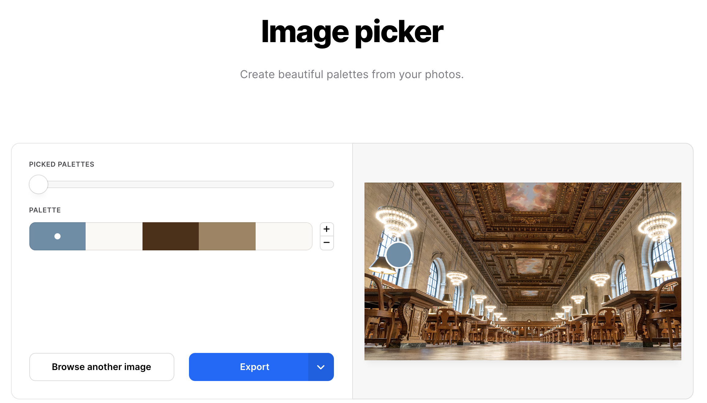

```{r setup, include=FALSE}
options(htmltools.dir.version = FALSE)
xaringanExtra::use_panelset()
library(countdown)
```

```{r xaringan-themer, include = FALSE, warning = FALSE, fig.showtext = FALSE}
library(xaringanthemer)
style_duo_accent(
  primary_color = "#866fa3",
  secondary_color = "#F1DE67",
  inverse_header_color = "#464a53",
  black_color = "#464a53",
  code_highlight_color = "#f1de67",
  header_font_google = google_font("Atkinson Hyperlegible"),
  text_font_google   = google_font("Atkinson Hyperlegible", "300", "300i"),
  code_font_google   = google_font("Source Code Pro"),
  code_font_size = "20px",
  title_slide_background_color = "#FFFFFF",
  title_slide_background_image = "https://github.com/vizdata-f21/slides/raw/main/vizdata-bg.jpeg",
  title_slide_background_size = "contain",
  base_font_size = "24px",
  header_h1_font_size = "1.9rem",
  header_h2_font_size = "1.75rem",
  header_h3_font_size = "1.5rem",
  extra_css = list(
    "h1" = list("margin-block-start" = "0.4rem", 
                 "margin-block-end" = "0.4rem"),
    "h2" = list("margin-block-start" = "0.4rem", 
                 "margin-block-end" = "0.4rem"),
    "h3" = list("margin-block-start" = "0.4rem", 
                 "margin-block-end" = "0.4rem"),
    ".tiny" = list("font-size" = "70%"),
    ".small" = list("font-size" = "80%"),
    ".midi" = list("font-size" = "90%"),
    ".tiny .remark-code" = list("font-size" = "70%"),
    ".small .remark-code" = list("font-size" = "80%"),
    ".midi .remark-code" = list("font-size" = "90%"),
    ".large" = list("font-size" = "200%"),
    ".huge" = list("font-size" = "400%",
                     "font-family" = "'Montserrat', sans-serif",
                     "font-weight" = "bold"),
    ".hand" = list("font-family" = "'Gochi Hand', cursive",
                   "font-size" = "125%"),
    ".task" = list("padding-right"    = "10px",
                   "padding-left"     = "10px",
                   "padding-top"      = "3px",
                   "padding-bottom"   = "3px",
                   "margin-bottom"    = "6px",
                   "margin-top"       = "6px",
                   "border-left"      = "solid 5px #F1DE67",
                   "background-color" = "#F1DE6750"),
    ".pull-left" = list("width" = "49%",
                        "float" = "left"),
    ".pull-right" = list("width" = "49%",
                         "float" = "right"),
    ".pull-left-wide" = list("width" = "70%",
                             "float" = "left"),
    ".pull-right-narrow" = list("width" = "27%",
                                "float" = "right"),
    ".pull-left-narrow" = list("width" = "27%",
                               "float" = "left"),
    ".pull-right-wide" = list("width" = "70%",
                              "float" = "right"),
    ".blue" = list(color = "#2A9BB7"),
    ".purple" = list(color = "#a493ba"),
    ".yellow" = list(color = "#f1de67"),
    ".gray" = list(color = "#464a53")
    )
  )
```

class: middle, inverse

# Welcome

---

## Announcements

- Revised proposals for my review: due Fri, Sep 24 (today) at 5pm

- Planning for project presentations

- A couple surveys coming your way!

---

## Agenda for today

- Wrap up: Colors

- Axes

- Annotation

---

## Setup

.midi[
```{r message = FALSE, warning = FALSE}
# load packages
library(tidyverse)
library(colorspace)
library(colorblindr) # install_github("wilkelab/colorblindr")
library(ggtext)
library(scales)
library(fs)
library(openintro)
library(palmerpenguins)
library(dsbox)

# set default theme for ggplot2
ggplot2::theme_set(ggplot2::theme_minimal(base_size = 16))

# set default figure parameters for knitr
knitr::opts_chunk$set(
  fig.width = 8, fig.asp = 0.618, fig.retina = 3,
  dpi = 300, out.width = "60%"
)

# dplyr print min and max
options(dplyr.print_max = 6, dplyr.print_min = 6)
```
]

---

class: inverse, middle

# Wrap up: Colors

---

## Color scales

1. Distinguish categories (qualitative)

2. Represent numeric values (sequential)

3. Represent numeric values (diverging)

4. Highlight

---

## The **colorspace** package

Scale name: `scale_<aesthetic>_<datatype>_<colorscale>()`

- `<aesthetic>`: name of the aesthetic (`fill`, `color`)
- `<datatype>`: type of variable plotted (`discrete`, `continuous`, `binned`)
- `<colorscale>`: type of the color scale (`qualitative`, `sequential`, `diverging`, `divergingx`)

---

## Qualitative palettes

```{r echo = FALSE, out.width = "85%"}
hcl_palettes("qualitative", n = 8, plot = TRUE)
```

---

## Sequential palettes

```{r echo = FALSE, out.width = "85%"}
hcl_palettes("sequential", n = 8, plot = TRUE)
```

---

## Diverging palettes

```{r echo = FALSE, out.width = "85%"}
hcl_palettes("diverging", n = 8, plot = TRUE)
```

---

## **ggplot2** + **colorspace**

```{r warning = FALSE}
p <- ggplot(penguins, aes(x = bill_length_mm, y = body_mass_g, color = species)) +
  geom_point(size = 3) +
  theme(legend.position = "top")
```

.pull-left[
```{r warning = FALSE, out.width = "100%"}
p +
  scale_color_discrete_qualitative() #<<
```
]
.pull-right[
```{r warning = FALSE, out.width = "100%"}
p +
  scale_color_discrete_sequential() #<<
```
]

---

## Color palettes + accessibility

At a minimum, use color palettes known to be colorblind friendly

```{r warning = FALSE, out.width = "70%", fig.asp = 0.55}
p +
  scale_color_OkabeIto() #<<
```

---

## Color palettes + accessibility

While not a perfect solution, simulating color blindness to check that your palette is color blind friendly is a good first step (e.g., [SimDaltonism](https://michelf.ca/projects/sim-daltonism/) is what I use)

.panelset[
.panel[.panel-name[Default]
```{r warning = FALSE, echo = FALSE}
p
```
]
.panel[.panel-name[OkabeIto]
```{r warning = FALSE, echo = FALSE}
p + scale_color_OkabeIto()
```
]
]

---

## Custom palettes

- Create your own palette with `colorspace::hclcolorpicker()`

- Keep chroma low!

---

## Color inspiration

- [Pantone colors of the year](https://www.pantone.com/color-of-the-year-archive), e.g. for 2021 Ultimate Gray and Illuminating

- Generate a palette from an image, e.g., with [coolors.co/image-picker](https://coolors.co/image-picker)

```{r echo = FALSE, fig.align = "center"}

```

---

## Colors for highlighting

Keep context in mind, e.g., here we're using the blue from the Connecticut flag

```{r echo = FALSE, out.width = "80%"}
lyme_data <- tribble(
  ~state, ~n,
  "Pennsylvania", 10208,
  "New Jersey", 4000,
  "New York", 3638,
  "Wisconsin", 1869,
  "Connecticut", 1859,
  "Maine", 1405,
  "Minnesota", 1541,
  "New Hampshire", 1428,
  "Maryland", 1382,
  "Virginia", 1139,
  "Rhode Island", 1111,
  "West Virginia", 671,
  "Vermont", 576,
  "Delaware", 520,
  "Ohio", 293,
  "Remaining States + DC", 2026
) %>%
  mutate(state = fct_inorder(state))

lyme_data %>%
  mutate(
    state = fct_reorder(state, n),
    state = fct_relevel(state, "Remaining States + DC", after = 0),
    highlight = if_else(state == "Connecticut", TRUE, FALSE),
    perc = paste0(round((n / sum(n)) * 100, 1), "%")
  ) %>%
  ggplot(aes(x = n, y = state, fill = highlight)) +
  geom_col(show.legend = FALSE) +
  #geom_text(aes(label = perc, color = highlight), nudge_x = 300, fontface = "bold", show.legend = FALSE) +
  scale_fill_manual(values = c("gray", "#0C2D83")) +
  #scale_x_continuous(labels = label_number()) +
  labs(
    title = "Lyme Disease Association Lyme Disease Analysis\n2018 US Reported Lyme Disease Cases Featuring Top 15 States",
    caption = "**U.S. TOTAL CASES 2018: 33,666** <br>Source: Data compiled from CDC pub. data (DVBD)",
    x = NULL, y = NULL
  ) +
  theme(
    plot.title.position = "plot",
    plot.caption = element_markdown()
  )
```


---

class: middle

.hand[livecoding...]

---

class: inverse, middle

# Axes

---

## Axis breaks

.task[
How can the following figure be improved with custom breaks in axes, if at all?
]

```{r echo = FALSE, message = FALSE, cache = TRUE}
# get a list of files with "Foreign Connected PAC" in their names
list_of_files <- dir_ls(path = here::here("09-axes-annotation/data"), regexp = "Foreign Connected PAC")

# read all files and row bind them
# keeping track of the file name in a new column called year
pac <- read_csv(list_of_files, id = "year")

pac <- pac %>%
  janitor::clean_names() %>%
  mutate(
    year = str_remove(year, "/Users/mine/Desktop/Teaching/Duke/STA 313 - F21/slides/09-axes-annotation/data/Foreign Connected PACs, "),
    year = str_remove(year, ".csv")
  ) %>%
  separate(year, into = c("year_discard", "year"), convert = TRUE) %>%
  separate(country_of_origin_parent_company, into = c("country_of_origin", "parent_company"), sep = "\\/", extra = "merge") %>%
  select(-year_discard, -total) %>%
  mutate(
    dems = str_remove(dems, "\\$"),
    repubs = str_remove(repubs, "\\$"),
    dems = as.numeric(dems),
    repubs = as.numeric(repubs)
  )

pac_longer <- pac %>%
  pivot_longer(
    cols = c(dems, repubs),
    names_to = "party",
    values_to = "amount"
  ) %>%
  mutate(party = if_else(party == "dems", "Democrat", "Republican"))

country_yearly_totals <- pac_longer %>%
  filter(country_of_origin == "UK") %>%
  group_by(year, party) %>%
  summarise(total_amount = sum(amount), .groups = "drop")
```

```{r echo = FALSE, message = FALSE, warning = FALSE, out.width = "70%"}
pac_plot <- ggplot(country_yearly_totals, aes(x = year, y = total_amount, color = party)) +
  geom_line(size = 1) +
  scale_color_manual(values = c("blue", "red")) +
  scale_y_continuous(labels = label_dollar(scale = 1/1000000, suffix = "M")) +
  labs(
    x = "Year",
    y = "Total amount",
    color = "Party",
    title = "Contributions to US political parties from UK-connected PACs",
    caption = "Source: OpenSecrets.org"
  ) +
  theme_minimal() +
  theme(
    legend.position = c(0.9, 0.15),
    axis.title.x = element_text(hjust = 0),
    axis.title.y = element_text(hjust = 0)
  )

pac_plot
```

---

## Context matters

```{r message = FALSE, warning = FALSE, out.width = "70%"}
pac_plot +
  scale_x_continuous(breaks = seq(from = 2000, to = 2020, by = 2)) #<<
```

---

## Conciseness matters

```{r message = FALSE, warning = FALSE, out.width = "70%"}
pac_plot +
  scale_x_continuous(breaks = seq(2000, 2020, 4))
```

---

## Precision matters

```{r message = FALSE, warning = FALSE, out.width = "70%"}
pac_plot +
  scale_x_continuous(breaks = seq(2000, 2020, 4)) +
  labs(x = "Election year") #<<
```

---

class: inverse

# Annotation

---

## `geom_text()`

Can be useful when individual observations are identifiable, but can also get overwhelming...

.task[
How would you improve this visualization?
]

.panelset[
.panel[.panel-name[Plots]
.pull-left[
```{r echo = FALSE, warning = FALSE, out.width = "100%", fig.asp = 0.5}
ggplot(state_stats, aes(x = homeownership, y = pop2010)) + 
  geom_point()
```
]
.pull-right[
```{r echo = FALSE, warning = FALSE, out.width = "100%", fig.asp = 0.5}
ggplot(state_stats, aes(x = homeownership, y = pop2010)) + 
  geom_text(aes(label = abbr))
```
]
]
.panel[.panel-name[Discuss]
<iframe src="https://app.sli.do/event/rxg9buzy" height="100%" width="100%" frameBorder="0" style="min-height: 560px;" title="Slido"></iframe>
]
]
