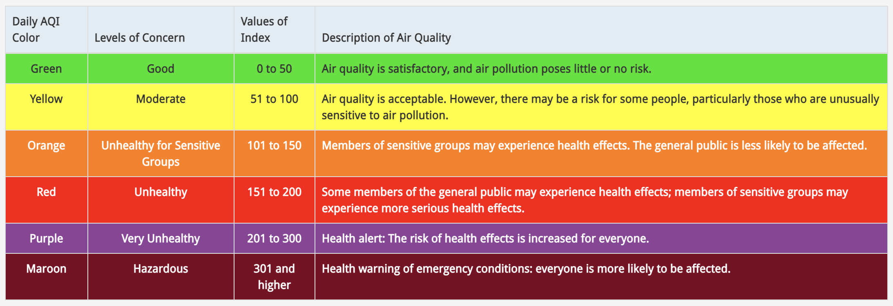
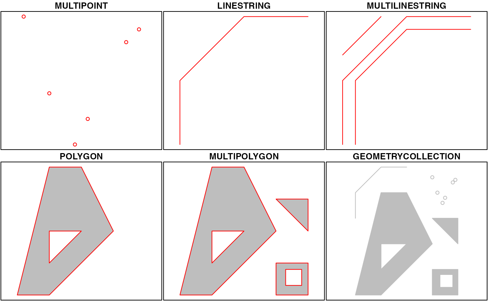
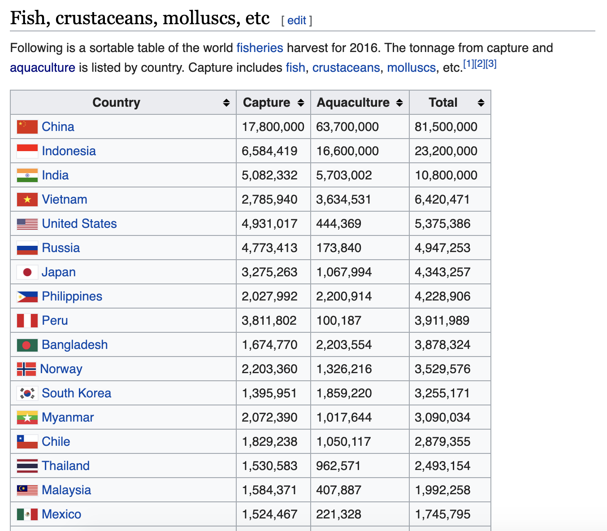

```{r setup, include=FALSE}
options(htmltools.dir.version = FALSE)
xaringanExtra::use_panelset()
library(countdown)
```

```{r xaringan-themer, include = FALSE, warning = FALSE, fig.showtext = FALSE}
library(xaringanthemer)
style_duo_accent(
  primary_color = "#866fa3",
  secondary_color = "#F1DE67",
  inverse_header_color = "#464a53",
  black_color = "#464a53",
  code_highlight_color = "#f1de67",
  header_font_google = google_font("Atkinson Hyperlegible"),
  text_font_google   = google_font("Atkinson Hyperlegible", "300", "300i"),
  code_font_google   = google_font("Source Code Pro"),
  code_font_size = "20px",
  title_slide_background_color = "#FFFFFF",
  title_slide_background_image = "https://github.com/vizdata-f21/slides/raw/main/vizdata-bg.jpeg",
  title_slide_background_size = "contain",
  base_font_size = "24px",
  header_h1_font_size = "1.9rem",
  header_h2_font_size = "1.75rem",
  header_h3_font_size = "1.5rem",
  extra_css = list(
    "h1" = list("margin-block-start" = "0.4rem", 
                 "margin-block-end" = "0.4rem"),
    "h2" = list("margin-block-start" = "0.4rem", 
                 "margin-block-end" = "0.4rem"),
    "h3" = list("margin-block-start" = "0.4rem", 
                 "margin-block-end" = "0.4rem"),
    ".tiny" = list("font-size" = "70%"),
    ".small" = list("font-size" = "80%"),
    ".midi" = list("font-size" = "90%"),
    ".tiny .remark-code" = list("font-size" = "70%"),
    ".small .remark-code" = list("font-size" = "80%"),
    ".midi .remark-code" = list("font-size" = "90%"),
    ".large" = list("font-size" = "200%"),
    ".huge" = list("font-size" = "400%",
                     "font-family" = "'Montserrat', sans-serif",
                     "font-weight" = "bold"),
    ".hand" = list("font-family" = "'Gochi Hand', cursive",
                   "font-size" = "125%"),
    ".task" = list("padding-right"    = "10px",
                   "padding-left"     = "10px",
                   "padding-top"      = "3px",
                   "padding-bottom"   = "3px",
                   "margin-bottom"    = "6px",
                   "margin-top"       = "6px",
                   "border-left"      = "solid 5px #F1DE67",
                   "background-color" = "#F1DE6750"),
    ".note" = list("padding-right"    = "10px",
               "padding-left"     = "10px",
               "padding-top"      = "3px",
               "padding-bottom"   = "3px",
               "margin-bottom"    = "6px",
               "margin-top"       = "6px",
               "border-left"      = "solid 5px #866fa3",
               "background-color" = "#866fa350"),
    ".pull-left" = list("width" = "49%",
                        "float" = "left"),
    ".pull-right" = list("width" = "49%",
                         "float" = "right"),
    ".pull-left-wide" = list("width" = "70%",
                             "float" = "left"),
    ".pull-right-narrow" = list("width" = "27%",
                                "float" = "right"),
    ".pull-left-narrow" = list("width" = "27%",
                               "float" = "left"),
    ".pull-right-wide" = list("width" = "70%",
                              "float" = "right"),
    ".blue" = list(color = "#2A9BB7"),
    ".purple" = list(color = "#a493ba"),
    ".yellow" = list(color = "#f1de67"),
    ".gray" = list(color = "#464a53")
    )
  )
```

class: middle, inverse

# Welcome

---

## Announcements

- Let me know by the end of class today if you want to work on improving your Project 1

- Decide as a team if you'd like to "own" your Project 1 repo and share it as part of your portfolio publicly, email me to let me know

- Get started on HW 3 before lab on Monday so you can get questions answered

---

## Setup

.midi[
```{r message = FALSE, warning = FALSE}
# load packages
library(tidyverse)
library(sf)
library(lubridate)
library(colorblindr)
library(gghighlight)
library(highcharter)
library(fs)
library(geosphere)
library(rnaturalearth)
library(rnaturalearthdata)
library(ggspatial)
library(dsbox)

# set default theme for ggplot2
ggplot2::theme_set(ggplot2::theme_minimal(base_size = 16))

# set default figure parameters for knitr
knitr::opts_chunk$set(
  fig.width = 8, fig.asp = 0.618, fig.retina = 3, dpi = 300, out.width = "60%"
)

# dplyr print min and max
options(dplyr.print_max = 6, dplyr.print_min = 6)
```
]

---

class: middle, inverse

# Wrap up: Visualizing multiple trends

---

## Remember: Air Quality Index

- The AQI is the Environmental Protection Agency's index for reporting air quality

- Higher values of AQI indicate worse air quality

```{r echo = FALSE, fig.alt = "AQI Basics for Ozone and Particle Pollution", out.width = "100%"}

```

.footnote[
Source: https://www.airnow.gov/aqi-basics
]

---

## AQI data

- Source: [EPA's  Daily Air Quality Tracker](https://www.epa.gov/outdoor-air-quality-data/air-data-daily-air-quality-tracker)

- 2016 - 2021 AQI (Ozone and PM2.5 combined) for Durham-Chapel Hill, NC core-based statistical area (CBSA), one file per year

```{r include = FALSE}
dch_files <- fs::dir_ls(here::here("11-visualize-time-series/", "data/durham-chapel-hill"))
```

.midi[
```{r eval = FALSE}
dch_files <- fs::dir_ls(here::here("data/durham-chapel-hill"))
```
]

.midi[
```{r message = FALSE}
dch <- read_csv(dch_files, na = c(".", ""))
```
]

- 2016 - 2021 AQI (Ozone and PM2.5 combined) for San Francisco-Oakland-Hayward, CA CBSA, one file per year

```{r include = FALSE}
sf_files <- fs::dir_ls(here::here("11-visualize-time-series/", "data/san-francisco"))
```

.midi[
```{r eval = FALSE}
sf_files <- fs::dir_ls(here::here("data/san-francisco"))
```
]

.midi[
```{r message = FALSE}
sf <- read_csv(sf_files, na = c(".", ""))
```
]

---

## Data cleaning

- Durham-Chapel Hill

.midi[
```{r}
dch <- dch %>%
  janitor::clean_names() %>%
  mutate(date = mdy(date),
         aqi_value = as.numeric(aqi_value),
         good_aqi = if_else(aqi_value <= 50, 1, 0)) %>%
  filter(!is.na(aqi_value)) %>%
  arrange(date) %>%
  mutate(cum_good_aqi = cumsum(good_aqi), .after = aqi_value)
```
]

- San Francisco-Oakland-Hayward

.midi[
```{r}
sf <- sf %>%
  janitor::clean_names() %>%
  mutate(date = mdy(date),
         aqi_value = as.numeric(aqi_value),
         good_aqi = if_else(aqi_value <= 50, 1, 0)) %>%
  filter(!is.na(aqi_value)) %>%
  arrange(date) %>%
  mutate(cum_good_aqi = cumsum(good_aqi), .after = aqi_value)
```
]

---

## Visualizing annual trends

```{r}
sf <- sf %>%
  mutate(
    year = year(date), 
    month = month(date),
    day = day(date),
    fake_date = ymd(as.Date(paste0(2000, "-", month, "-", day))),
    .after = date
    )

sf
```

---

## Visualizing annual trends

.panelset.sideways[
```{r panelset = c(source = "Code", output = "Plot"), out.width = "100%"}
ggplot(sf, aes(x = fake_date, y = aqi_value, 
               group = year, color = factor(year))) +
  geom_line() +
  scale_x_date(date_labels = "%b") +
  scale_color_OkabeIto() +
  labs(
    x = NULL, y = "AQI", color = "Year",
    title = "Ozone and PM2.5 Daily AQI Values",
    subtitle = "San Francisco-Oakland-Hayward, CA",
    caption = "\nSource: EPA Daily Air Quality Tracker"
  ) +
  theme(
    plot.title.position = "plot",
    panel.grid.minor.y = element_blank(),
    panel.grid.minor.x = element_blank()
  )
```
]

---

## Highlighting

Highlight a given year

.panelset.sideways[
```{r panelset = c(source = "Code", output = "Plot"), out.width = "100%", message = FALSE, warning = FALSE}
ggplot(sf, aes(x = fake_date, y = aqi_value, group = year)) +
  geom_line() +
  gghighlight(year == 2018, label_key = year) + #<<
  scale_x_date(date_labels = "%b") +
  labs(
    x = NULL, y = "AQI", color = "Year",
    title = "Ozone and PM2.5 Daily AQI Values",
    subtitle = "San Francisco-Oakland-Hayward, CA",
    caption = "\nSource: EPA Daily Air Quality Tracker"
  ) +
  theme(
    plot.title.position = "plot",
    panel.grid.minor.y = element_blank(),
    panel.grid.minor.x = element_blank()
  )
```
]

---

## Highlighting

Customizing highlighting style

.panelset.sideways[
```{r panelset = c(source = "Code", output = "Plot"), out.width = "100%", message = FALSE, warning = FALSE}
ggplot(sf, aes(x = fake_date, y = aqi_value, group = year)) +
  geom_line(color = "firebrick4", size = 1) + #<<
  gghighlight(
    year == 2018, label_key = year, 
    unhighlighted_params = list(size = 0.2, color = "darkgray") #<<
    ) + 
  scale_x_date(date_labels = "%b") +
  labs(
    x = NULL, y = "AQI", color = "Year",
    title = "Ozone and PM2.5 Daily AQI Values",
    subtitle = "San Francisco-Oakland-Hayward, CA",
    caption = "\nSource: EPA Daily Air Quality Tracker"
  ) +
  theme(
    plot.title.position = "plot",
    panel.grid.minor.y = element_blank(),
    panel.grid.minor.x = element_blank()
  )
```
]

---

## Highlighting

Customizing labels

.small[
.panelset.sideways[
```{r panelset = c(source = "Code", output = "Plot"), out.width = "100%", message = FALSE, warning = FALSE}
ggplot(sf, aes(x = fake_date, y = aqi_value, group = year)) +
  geom_line(color = "firebrick4", size = 1) +
  gghighlight(
    year == 2018, label_key = year, 
    unhighlighted_params = list(size = 0.2, color = "darkgray"),
    use_direct_label = FALSE #<<
    ) + 
  annotate( #<<
    "label", x = ymd("2000-12-15"), y = 225, #<<
    label = "2018", fill = "firebrick4", color = "white" #<<
    ) + #<<
  scale_x_date(date_labels = "%b") +
  labs(
    x = NULL, y = "AQI", color = "Year",
    title = "Ozone and PM2.5 Daily AQI Values",
    subtitle = "San Francisco-Oakland-Hayward, CA",
    caption = "\nSource: EPA Daily Air Quality Tracker"
  ) +
  theme(
    plot.title.position = "plot",
    panel.grid.minor.y = element_blank(),
    panel.grid.minor.x = element_blank()
  )
```
]
]

---

## Highlighting

Highlight any years where the average AQI is over 50

.midi[
.panelset.sideways[
```{r panelset = c(source = "Code", output = "Plot"), out.width = "100%", message = FALSE, warning = FALSE}
ggplot(sf, aes(x = fake_date, y = aqi_value, group = year, color = factor(year))) +
  geom_line(show.legend = FALSE) +
  gghighlight(
    mean(aqi_value) > 50, #<<
    label_key = year, use_direct_label = FALSE
    ) + 
  scale_x_date(date_labels = "%b") +
  scale_color_OkabeIto(darken = 0.5) +
  labs(
    x = NULL, y = "AQI", color = "Year",
    title = "Ozone and PM2.5 Daily AQI Values",
    subtitle = "San Francisco-Oakland-Hayward, CA",
    caption = "\nSource: EPA Daily Air Quality Tracker"
  ) +
  theme(
    plot.title.position = "plot",
    panel.grid.minor.y = element_blank(),
    panel.grid.minor.x = element_blank()
  ) +
  facet_wrap(~ year) #<<
```
]
]

---

class: middle, inverse

# Wrap up: Interactive plots

---

## Interactive plots

Using the **highcharter** package

.panelset.sideways[
```{r panelset = c(source = "Code", output = "Plot"), out.width = "100%"}
highchart(type = "stock") %>%
  hc_add_series(
    data = dch, 
    hcaes(x = date, y = aqi_value), 
    type = "line",
    color = "#4E72E3",
    showInLegend = FALSE
    ) %>%
  hc_title(
    text = "Ozone and PM2.5 Daily AQI Values",
    align = "left"
    ) %>%
  hc_subtitle(
    text = "Durham-Chapel Hill, NC",
    align = "left"
    ) %>%
  hc_rangeSelector(enabled = FALSE)
```
]

---

class: middle, inverse

# Geospatial data in the real world

---

## Visualizing geographic areas

Without any projection, on the cartesian coordinate system

```{r}
world_map <- ggplot(map_data("world"), aes(long, lat, group = group)) +
  geom_polygon(fill = "white", color = "#3c3b6e", size = 0.3) +
  labs(x = NULL, y = NULL)

world_map
```

---

## Mercator projection

Meridians are equally spaced and vertical, parallels are horizontal lines whose spacing increases the further we move away from the equator

```{r}
world_map +
  coord_map(projection = "mercator") #<<
```

---

## Mercator projection

.hand[without the weird straight lines through the earth!]

```{r out.width = "55%"}
world_map +
  coord_map(
    projection = "mercator", 
    xlim = c(-180, 180) #<<
    )
```

---

## Sinusoidal projection

Parallels are equally spaced

```{r}
world_map +
  coord_map(projection = "sinusoidal", xlim = c(-180, 180)) #<<
```

---

## Orthographic projection

Viewed from infinity

```{r}
world_map +
  coord_map(projection = "orthographic") #<<
```

---

## Mollweide projection

Equal-area, hemisphere is a circle

```{r}
world_map +
  coord_map(projection = "mollweide", xlim = c(-180, 180)) #<<
```

---

## Visualizing distances

.task[
Draw a line between Istanbul and Los Angeles.
]

```{r}
cities <- tribble(
  ~city,         ~long,    ~lat,
  "istanbul",    28.9784,  41.0082,
  "los angeles", -118.243, 34.0522,
)
```

```{r echo = FALSE, out.width = "50%"}
world_map +
  geom_point(
    data = cities, aes(x = long, y = lat, group = NULL),
    size = 2, color = "red"
  )
```


---

## Visualizing distances

As if the earth is flat

.panelset.sideways[
```{r panelset = c(source = "Code", output = "Plot"), out.width = "100%"}
world_map +
  geom_point(
    data = cities, aes(x = long, y = lat, group = NULL),
    size = 2, color = "red"
  ) +
  geom_line(
    data = cities, aes(x = long, y = lat, group = NULL),
    size = 1, color = "red"
  )
```
]

---

## Visualizing distances

Based on a spherical model of the earth

```{r ist-la-intermediate, include = FALSE}
gc <- geosphere::gcIntermediate(
  p1 = cities %>% filter(city == "istanbul")    %>% select(-city), 
  p2 = cities %>% filter(city == "los angeles") %>% select(-city), 
  n = 100, 
  addStartEnd = TRUE
  ) %>%
  as_tibble()
```

```{r both-distances, echo = FALSE}
world_map +
  geom_point(
    data = cities, aes(x = long, y = lat, group = NULL),
    size = 2, color = "red"
  ) +
  geom_line(
    data = cities, aes(x = long, y = lat, group = NULL),
    size = 1, color = "red"
  ) +
  geom_line(
    data = gc, aes(x = lon, y = lat, group = NULL),
    size = 1, color = "red", linetype = "dashed"
  )
```

---

## Intermediate points on the great circle

```{r ref.label = "ist-la-intermediate"}
```

```{r}
gc
```

---

## Plotting both distances

.panelset.sideways[
```{r ref.label = "both-distances", panelset = c(source = "Code", output = "Plot"), out.width = "100%"}
```
]

---

## Dateline

.task[
How long does it take to fly from the Western most point in the US to the Eastern most point?
]

```{r echo = FALSE, message = FALSE, warning = FALSE, out.width = "80%"}
ak <- st_read("data/ak/states.shp", quiet = TRUE, stringsAsFactors = FALSE)

par(mar = c(3, 3, 1, 1))

ak_geom <- st_geometry(ak)

west_hem <- st_polygon(list(matrix(c(-180, 90, -180, -90, 0, -90, 0, 90, -180, 90), ncol = 2, byrow = TRUE))) %>%
  st_sfc() %>%
  st_set_crs("+proj=longlat +datum=WGS84")

east_hem <- st_polygon(list(matrix(c(180, 90, 180, -90, 0, -90, 0, 90, 180, 90), ncol = 2, byrow = TRUE))) %>%
  st_sfc() %>%
  st_set_crs("+proj=longlat +datum=WGS84")

ak_west <- st_intersection(ak_geom, west_hem)
ak_east <- st_intersection(ak_geom, east_hem)

ak_east_shift <- (ak_east - c(360, 0)) %>% st_set_crs("+proj=longlat +datum=WGS84")

ak_shift <- st_union(ak_east_shift, ak_west)

plot(ak_shift, axes = TRUE, col = "black", border = NA, xlim = c(-190, -130))
points(c(-360 + 179.776, -179.146), c(51.952, 51.273), col = "red")
abline(v = -180, col = "blue", lty = 2)
```

---

class: middle, inverse

# Using **sf**

---

## Simple Features for R

```{r echo = FALSE, fig.alt = "Simple features for R", out.width = "60%"}
knitr::include_graphics("images/sf.jpeg")
```

.footnote[
Illustration by Allison Horst
]

---

## Simple features

```{r echo = FALSE, fig.alt = "Simple features", out.width = "70%"}

```

.footnote[
Source: [Simple Features for R](https://r-spatial.github.io/sf/articles/sf1.html#sf-objects-with-simple-features-1)
]

---

## The sf package

.pull-left[
A package that provides simple features access for R

- represents simple features as records in a `data.frame` or `tibble` with a `geometry` list-column
- represents natively in R all 17 simple feature types for all dimensions
- ...

<br>

Learn more at [r-spatial.github.io/sf](https://r-spatial.github.io/sf).
]
.pull-right[
```{r echo = FALSE, fig.alt = "Hex logo for sf", out.width = "50%"}
knitr::include_graphics("images/sf-hex.gif")
```
]

---

## Get world data

Using the **rnaturalearth** package

```{r}
world <- ne_countries(scale = "medium", returnclass = "sf")
class(world)
```

---

## sf geometry

.small[
```{r}
world %>% select(geometry)
```
]

---

## Map the world with sf

```{r}
ggplot(data = world) +
  geom_sf() #<<
```

---

## Plays nicely with ggplot2

```{r}
ggplot(data = world) +
  geom_sf(fill = "cornsilk", size = 0.2) +
  labs(x = "Longitude", y = "Latitude", title = "World map") +
  theme(panel.background = element_rect("lightblue"))
```

---

## Plays nicely with ggplot2

```{r}
ggplot(data = world) +
  geom_sf(aes(fill = pop_est)) +
  scale_fill_viridis_c(option = "plasma", trans = "sqrt")
```

---

## Projections with sf

```{r}
ggplot(data = world) +
    geom_sf() +
    coord_sf( #<<
      crs = "+proj=laea +lat_0=52 +lon_0=10 +x_0=4321000 +y_0=3210000 +ellps=GRS80 +units=m +no_defs " #<<
      ) #<<
```

---

## Scale bar and North arrow

Using the **ggspatial** package

```{r}
ggplot(data = world) +
  geom_sf(fill = "cornsilk") +
  annotation_scale(location = "bl", width_hint = 0.4) +
  annotation_north_arrow(
    location = "bl", which_north = "true", 
    pad_x = unit(0.5, "in"), pad_y = unit(0.3, "in"),
    style = north_arrow_fancy_orienteering) +
  coord_sf(xlim = c(24, 45), ylim = c(32, 43))
```

---


class: middle, center

# Fisheries of the world

---

Fisheries and Aquaculture Department of the Food and Agriculture Organization of the United Nations collects data on fisheries production of countries. The (not-so-great) visualization belows shows the distribution of fishery harvest of countries for 2018, by capture and aquaculture.  

<br>

.pull-left[
```{r echo=FALSE, out.width="100%", fig.align="center"}

```
]
.pull-right[
- Countries whose total harvest was less than 100,000 tons are not 
included in the visualization.
- Source: [Fishing industry by country](https://en.wikipedia.org/wiki/Fishing_industry_by_country)
]

---

.question[
What are some ways you would improve this visualization?
]

```{r echo=FALSE, out.width="80%", fig.align="center"}
knitr::include_graphics("images/fisheries.png")
```

---

## Get the data

From the **dsbox** package

```{r}
names(fisheries)
```

---

## Inspect the data

.midi[
```{r}
fisheries
```
]

---

## Data prep

Filter out countries whose total harvest was less than 100,000 tons since they 
are not included in the visualization:

.pull-left[
```{r}
fisheries <- fisheries %>%
  mutate(total = capture + aquaculture) %>%
  filter(total > 100000)
```
]
.pull-right[
```{r}
fisheries
```
]

---

## Mapping the fisheries data

- Obtain country boundaries and store as a data frame
- Join the fisheries and country boundaries data frames
- Plot the country boundaries, and fill by fisheries harvest data

---

## `map_data()`

The `map_data()` function easily turns data from the maps package in to a data frame suitable for plotting with ggplot2:

```{r}
map_data("world")
```

---

## A few fixes for better matching

.question[
What does the following code do?
]

```{r}
world_map <- map_data("world") %>%
  mutate(region = case_when(
    subregion == "Hong Kong" ~ "Hong Kong",
    TRUE                     ~ region
    )
  )
```

---

## Map the world

.midi[
```{r fig.height=5, fig.width=12}
ggplot(world_map, aes(x = long, y = lat, group = group)) +
  geom_polygon(fill = "gray") +
  theme_minimal()
```
]

---

## Join fisheries and world map

.pull-left[
```{r}
fisheries %>% select(country)
```
]
.pull-right[
```{r}
world_map %>% select(region)
```
]

---

## Join fisheries and world map

```{r}
fisheries_map <- left_join(fisheries, world_map, 
                           by = c("country" = "region"))
```

```{r}
glimpse(fisheries_map)
```

---

## Mapping fisheries

.question[
What is missing/misleading about the following map?
]

.midi[
```{r fig.height=4.5, fig.width=12}
ggplot(fisheries_map, mapping = aes(x = long, y = lat, group = group)) +
  geom_polygon(aes(fill = capture)) +
  scale_fill_viridis_c() +
  theme_minimal()
```
]

---

.hand[
livecoding
]
