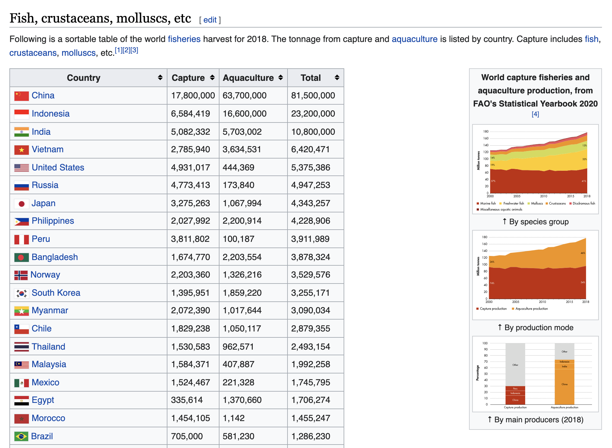
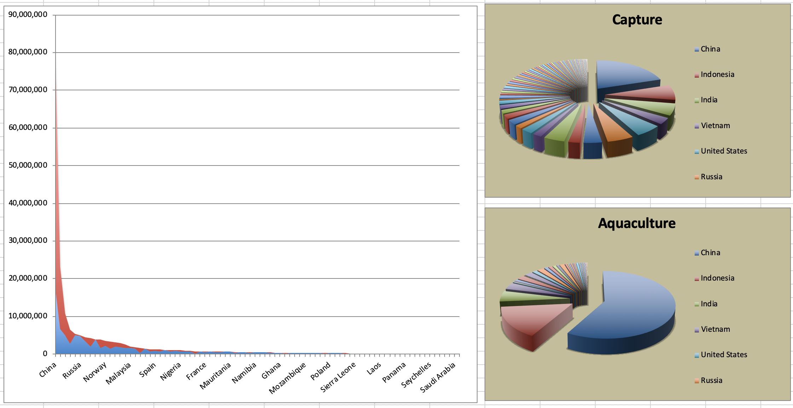

```{r setup, include=FALSE}
options(htmltools.dir.version = FALSE)
xaringanExtra::use_panelset()
library(countdown)
```

```{r xaringan-themer, include = FALSE, warning = FALSE, fig.showtext = FALSE}
library(xaringanthemer)
style_duo_accent(
  primary_color = "#866fa3",
  secondary_color = "#F1DE67",
  inverse_header_color = "#464a53",
  black_color = "#464a53",
  code_highlight_color = "#f1de67",
  header_font_google = google_font("Atkinson Hyperlegible"),
  text_font_google   = google_font("Atkinson Hyperlegible", "300", "300i"),
  code_font_google   = google_font("Source Code Pro"),
  code_font_size = "20px",
  title_slide_background_color = "#FFFFFF",
  title_slide_background_image = "https://github.com/vizdata-f21/slides/raw/main/vizdata-bg.jpeg",
  title_slide_background_size = "contain",
  base_font_size = "24px",
  header_h1_font_size = "1.9rem",
  header_h2_font_size = "1.75rem",
  header_h3_font_size = "1.5rem",
  extra_css = list(
    "h1" = list("margin-block-start" = "0.4rem", 
                 "margin-block-end" = "0.4rem"),
    "h2" = list("margin-block-start" = "0.4rem", 
                 "margin-block-end" = "0.4rem"),
    "h3" = list("margin-block-start" = "0.4rem", 
                 "margin-block-end" = "0.4rem"),
    ".tiny" = list("font-size" = "70%"),
    ".small" = list("font-size" = "80%"),
    ".midi" = list("font-size" = "90%"),
    ".tiny .remark-code" = list("font-size" = "70%"),
    ".small .remark-code" = list("font-size" = "80%"),
    ".midi .remark-code" = list("font-size" = "90%"),
    ".large" = list("font-size" = "200%"),
    ".huge" = list("font-size" = "400%",
                     "font-family" = "'Montserrat', sans-serif",
                     "font-weight" = "bold"),
    ".hand" = list("font-family" = "'Gochi Hand', cursive",
                   "font-size" = "125%"),
    ".task" = list("padding-right"    = "10px",
                   "padding-left"     = "10px",
                   "padding-top"      = "3px",
                   "padding-bottom"   = "3px",
                   "margin-bottom"    = "6px",
                   "margin-top"       = "6px",
                   "border-left"      = "solid 5px #F1DE67",
                   "background-color" = "#F1DE6750"),
    ".note" = list("padding-right"    = "10px",
               "padding-left"     = "10px",
               "padding-top"      = "3px",
               "padding-bottom"   = "3px",
               "margin-bottom"    = "6px",
               "margin-top"       = "6px",
               "border-left"      = "solid 5px #866fa3",
               "background-color" = "#866fa350"),
    ".pull-left" = list("width" = "49%",
                        "float" = "left"),
    ".pull-right" = list("width" = "49%",
                         "float" = "right"),
    ".pull-left-wide" = list("width" = "70%",
                             "float" = "left"),
    ".pull-right-narrow" = list("width" = "27%",
                                "float" = "right"),
    ".pull-left-narrow" = list("width" = "27%",
                               "float" = "left"),
    ".pull-right-wide" = list("width" = "70%",
                              "float" = "right"),
    ".blue" = list(color = "#2A9BB7"),
    ".purple" = list(color = "#a493ba"),
    ".yellow" = list(color = "#f1de67"),
    ".gray" = list(color = "#464a53")
    )
  )
```

class: middle, inverse

# Welcome

---

## Announcements

- 

---

## Setup

.midi[
```{r message = FALSE, warning = FALSE}
# load packages
library(tidyverse)
library(scales)
library(geofacet)
library(lubridate)

# set default theme for ggplot2
ggplot2::theme_set(ggplot2::theme_minimal(base_size = 16))

# set default figure parameters for knitr
knitr::opts_chunk$set(
  fig.width = 8, fig.asp = 0.618, fig.retina = 3, dpi = 300, out.width = "60%"
)

# dplyr print min and max
options(dplyr.print_max = 6, dplyr.print_min = 6)
```
]

---

class: middle, inverse

# Fisheries of the world

---

Fisheries and Aquaculture Department of the Food and Agriculture Organization of the United Nations collects data on fisheries production of countries. The (not-so-great) visualization below shows the distribution of fishery harvest of countries for 2018, by capture and aquaculture.  

<br>

.pull-left[
```{r echo=FALSE, out.width="100%", fig.align="center"}

```
]
.pull-right[
- Countries whose total harvest was less than 100,000 tons are not 
included in the visualization.
- Source: [Fishing industry by country](https://en.wikipedia.org/wiki/Fishing_industry_by_country)
]

---

.question[
What are some ways you would improve this visualization?
]

```{r echo=FALSE, out.width="80%", fig.align="center"}

```

---

## Get the data

```{r include = FALSE}
fisheries <- read_csv(here::here("13-visualize-spatial-II", "data/fisheries.csv"))
```

```{r eval = FALSE}
fisheries <- read_csv("data/fisheries.csv")
```


---

## Inspect the data

.midi[
```{r}
fisheries
```
]

---

## Data prep

Calculate total fishing

.pull-left[
```{r}
fisheries <- fisheries %>%
  mutate(total = capture + aquaculture)
```
]
.pull-right[
```{r}
fisheries
```
]

---

## Mapping the fisheries data

- Obtain country boundaries and store as a data frame
- Join the fisheries and country boundaries data frames
- Plot the country boundaries, and fill by fisheries harvest data

---

## `map_data()`

The `map_data()` function easily turns data from the maps package in to a data frame suitable for plotting with ggplot2:

```{r}
world_map <- map_data("world") %>% as_tibble()
```

---

## Mapping the world

.midi[
```{r out.width = "70%"}
ggplot(world_map, aes(x = long, y = lat, group = group)) +
  geom_polygon(fill = "gray") +
  coord_quickmap()
```
]

---

## Join fisheries and world map

.pull-left[
```{r}
fisheries %>% select(country)
```
]
.pull-right[
```{r}
world_map %>% select(region)
```
]

---

## Join fisheries and world map

```{r}
fisheries_map <- left_join(fisheries, world_map, by = c("country" = "region"))
```

```{r}
glimpse(fisheries_map)
```

---

## Mapping fisheries

.task[
What is missing/misleading about the following map?
]

.midi[
```{r out.width = "65%"}
ggplot(fisheries_map, mapping = aes(x = long, y = lat, group = group)) +
  geom_polygon(aes(fill = capture)) +
  scale_fill_viridis_c() +
  coord_quickmap()
```
]

---

class: middle

.hand[
livecoding
]

---

background-color: #114E8B

```{r echo = FALSE, out.width = "95%"}
fisheries <- fisheries %>%
  mutate(country = case_when(
    country == "United States" ~ "USA",
    country == "United Kingdom" ~ "UK",
    country == "Federated States of Micronesia" ~ "Micronesia",
    country == "Republic of the Congo" ~ "Democratic Republic of the Congo",
    country == "Curaçao" ~ "Curacao",
    country == "São Tomé and Príncipe" ~ "Sao Tome and Principe",
    country == "Curaçao" ~ "Curacao",
    country == "Saint-Martin" ~ "Saint Martin",
    TRUE ~ country
  ))

world_map <- world_map %>%
  mutate(region = case_when(
    subregion == "Hong Kong" ~ "Hong Kong",
    subregion == "Macao" ~ "Macao",
    region == "Saint Kitts" ~ "Saint Kitts and Nevis",
    region == "Nevis" ~ "Saint Kitts and Nevis",
    region == "Saint Vincent" ~ "Saint Vincent and the Grenadines",
    region == "Grenadines" ~ "Saint Vincent and the Grenadines",
    region == "Jersey" ~ "Jersey and Guernsey",
    region == "Guernsey" ~ "Jersey and Guernsey",
    region == "Antigua" ~ "Antigua and Barbuda",
    region == "Barbuda" ~ "Antigua and Barbuda",
    region == "Trinidad" ~ "Trinidad and Tobago",
    region == "Tobago" ~ "Trinidad and Tobago",
    region == "Virgin Islands" & subregion == " British" ~ "British Virgin Islands",
    region == "Virgin Islands" & subregion == " US" ~ "US Virgin Islands",
    region == "Swaziland" ~ "Eswatini",
    TRUE ~ region
  ))

fisheries_map <- left_join(world_map, fisheries, by = c("region" = "country"))

fisheries_map %>%
  mutate(total = total + 1) %>%
  ggplot(mapping = aes(x = long, y = lat, group = group)) +
  geom_polygon(aes(fill = total), color = "gray", size = 0.1) +
  scale_fill_viridis_c(
    name = "Total harvest\n(tonnes)",
    trans = "log",
    labels = label_number(big.mark = ","),
    na.value = "gray"
  ) +
  theme_void() +
  theme(
    text = element_text(color = "white"),
    legend.position = "bottom",
    legend.key.width = unit(2, "cm"),
    legend.key.height = unit(0.3, "cm"),
    plot.background = element_rect(fill = "dodgerblue4", color = "dodgerblue4"),
    plot.title = element_text(hjust = 0.5),
    plot.subtitle = element_text(hjust = 0.5)
  ) +
  labs(
    title = "Total fisheries harvest, 2018",
    subtitle = "By country",
    caption = "Source: Wikipedia"
  )
```


---

## Highlights from livecoding

- When working through non-matching unique identifiers in a join, you might need to clean the data in both data frames being merged, depending on the context

- Two ways to surface polygons with `NA`s:
  - `left_join()` map to data, layering with map at the bottom, data on top
  - `left_join()` data to map, set `na.value` in `scale_fill_*()` to desired color

- Use `na.value = "red"` (or some other color that will stand out) to easily spot polygons with `NA`s

---

class: middle, inverse

# Geofaceting

---

```{r echo = FALSE, message = FALSE}
us_state_vaccinations <- read_csv(here::here("13-visualize-spatial-II", "data/us_state_vaccinations.csv"))

us_state_vaccinations <- us_state_vaccinations %>%
  mutate(location = if_else(location == "New York State", "New York", location)) %>%
  filter(location %in% c(state.name, "District of Columbia"))
```

```{r geofacet-state, echo = FALSE, message = FALSE, cache = TRUE, warning = FALSE, out.width = "90%", fig.width = 12}
ggplot(us_state_vaccinations, aes(x = date, y = people_fully_vaccinated_per_hundred, group = location)) +
  geom_area() +
  facet_geo(~location) +
  scale_y_continuous( #<<
    limits = c(0, 100), #<<
    breaks = c(0, 50, 100), #<<
    minor_breaks = c(25, 75) #<<
    ) + #<<
  scale_x_date(breaks = c(ymd("2021-01-01", "2021-05-01", "2021-09-01")), date_labels = "%b") + #<<
  labs(
    x = NULL, y = NULL,
    title = "Covid-19 vaccination rate in the US",
    subtitle = "Daily number of people fully vaccinated, per hundred",
    caption = "Source: Our World in Data"
  ) +
  theme(
    strip.text.x = element_text(size = 7), #<<
    axis.text = element_text(size = 8), #<<
    plot.title.position = "plot"
  )
```

---

## Daily US vaccine data by state

```{r include = FALSE}
us_state_vaccinations <- read_csv(here::here("13-visualize-spatial-II", "data/us_state_vaccinations.csv"))
```

.small[
```{r eval = FALSE}
us_state_vaccinations <- read_csv(here::here("data/us_state_vaccinations.csv"))
```

```{r}
us_state_vaccinations
```

]

.footnote[
Source: https://ourworldindata.org/us-states-vaccinations
]

---

## Facet by location

.panelset.sideways[
```{r panelset = c(source = "Code", output = "Plot"), out.width = "100%", fig.width = 12, cache = TRUE}
ggplot(
  us_state_vaccinations,
  aes(x = date, y = people_fully_vaccinated_per_hundred)
) +
  geom_area() +
  facet_wrap(~location)
```
]

---

## Data cleaning

```{r}
us_state_vaccinations <- us_state_vaccinations %>%
  mutate(location = if_else(location == "New York State", "New York", location)) %>%
  filter(location %in% c(state.name, "District of Columbia"))
```

---

## Geofacet by state

Using `geofacet::facet_geo()`:

.panelset.sideways[
```{r panelset = c(source = "Code", output = "Plot"), out.width = "95%", fig.width = 12, cache = TRUE}
ggplot(us_state_vaccinations, 
       aes(x = date, y = people_fully_vaccinated_per_hundred)) +
  geom_area() +
  facet_geo(~ location) + #<<
  labs(
    x = NULL, y = NULL,
    title = "Covid-19 vaccination rate in the US",
    subtitle = "Daily number of people fully vaccinated, per hundred",
    caption = "Source: Our World in Data"
  )
```
]

---

## Geofacet by state, with improvements

.panelset.sideways[
.panel[.panel-name[Plot]
```{r ref.label = "geofacet-state", echo = FALSE, message = FALSE, warning = FALSE, out.width = "100%", fig.width = 12}
```
]
.panel[.panel-name[Code]
.midi[
```{r ref.label = "geofacet-state", echo = TRUE, message = FALSE, warning = FALSE, fig.show = "hide"}
```
]
]
]

---

## Bring in 2020 Presidential election results

```{r include = FALSE}
election_2020 <- read_csv(here::here("13-visualize-spatial-II", "data/us-election-2020.csv"))
```

```{r eval = FALSE}
election_2020 <- read_csv(here::here("data/us-election-2020.csv"))
```

```{r}
election_2020
```

---

## Geofacet by state, color by presidential election result

.small[
.panelset.sideways[
```{r panelset = c(source = "Code", output = "Plot"), out.width = "100%", fig.width = 12, cache = TRUE, warning = FALSE}
us_state_vaccinations %>%
  left_join(election_2020, by = c("location" = "state")) %>%
  ggplot(aes(x = date, y = people_fully_vaccinated_per_hundred)) +
  geom_area(aes(fill = win)) + #<<
  facet_geo(~location) +
  scale_y_continuous(limits = c(0, 100), breaks = c(0, 50, 100), minor_breaks = c(25, 75)) + #<<
  scale_x_date(breaks = c(ymd("2021-01-01", "2021-05-01", "2021-09-01")), date_labels = "%b") +
  scale_fill_manual(values = c("#2D69A1", "#BD3028")) + #<<
  labs(
    x = NULL, y = NULL,
    title = "Covid-19 vaccination rate in the US",
    subtitle = "Daily number of people fully vaccinated, per hundred",
    caption = "Source: Our World in Data",
    fill = "2020 Presidential\nElection"
  ) +
  theme(
    strip.text.x = element_text(size = 7),
    axis.text = element_text(size = 8),
    plot.title.position = "plot",
    legend.position = c(0.93, 0.15), #<<
    legend.text = element_text(size = 9),  #<<
    legend.title = element_text(size = 11),  #<<
    legend.background = element_rect(color = "gray", size = 0.5)  #<<
  )
```
]
]
