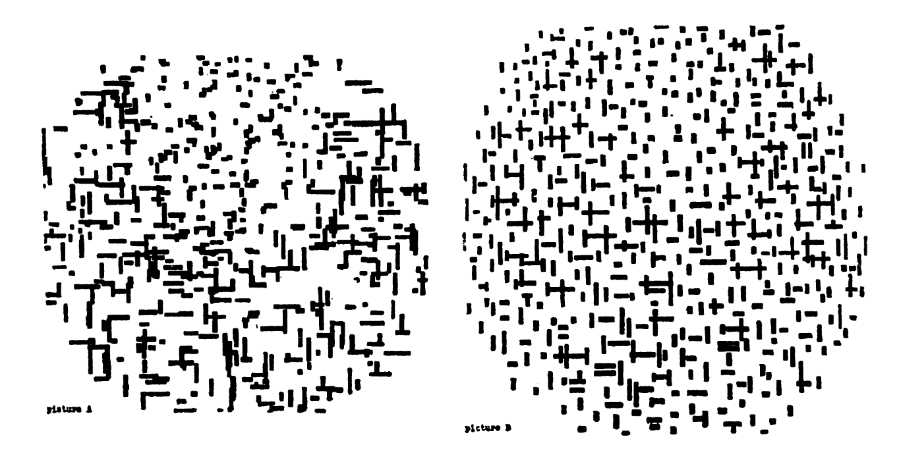
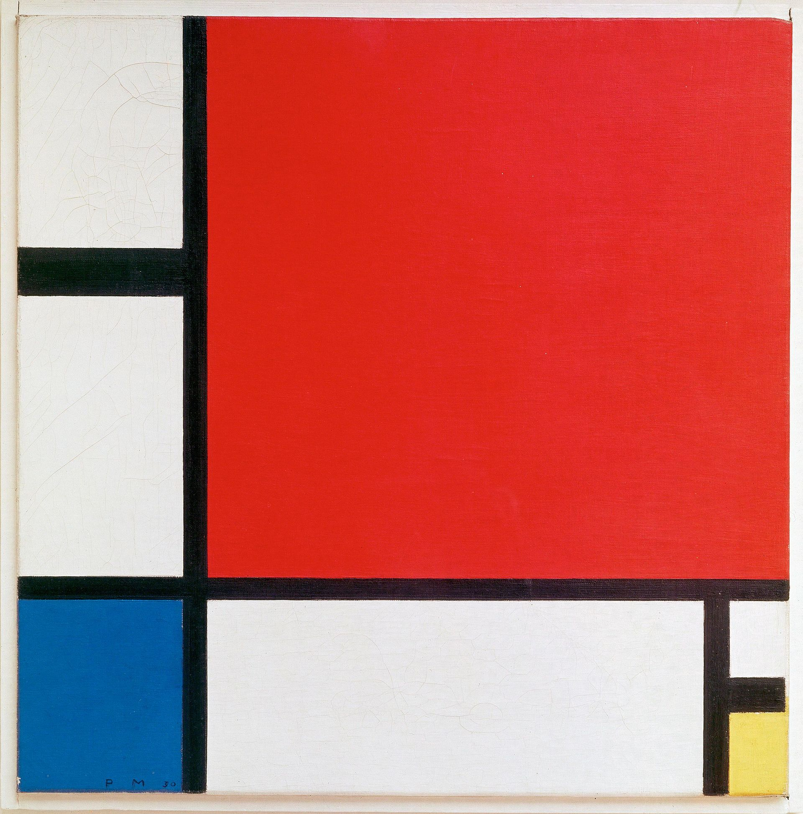

```{r setup, include=FALSE}
options(htmltools.dir.version = FALSE)
xaringanExtra::use_panelset()
library(countdown)
```

```{r xaringan-themer, include = FALSE, warning = FALSE, fig.showtext = FALSE}
library(xaringanthemer)
style_duo_accent(
  primary_color = "#866fa3", # purple
  secondary_color = "#F1DE67", # yellow
  inverse_header_color = "#464a53", # dark gray
  black_color = "#464a53",
  code_highlight_color = "#f1de67",
  header_font_google = google_font("Atkinson Hyperlegible"),
  text_font_google   = google_font("Atkinson Hyperlegible", "300", "300i"),
  code_font_google   = google_font("Source Code Pro"),
  code_font_size = "20px",
  title_slide_background_color = "#FFFFFF",
  title_slide_background_image = "https://github.com/vizdata-f21/slides/raw/main/vizdata-bg.jpeg",
  title_slide_background_size = "contain",
  base_font_size = "24px",
  header_h1_font_size = "1.9rem",
  header_h2_font_size = "1.75rem",
  header_h3_font_size = "1.5rem",
  extra_css = list(
    "h1" = list("margin-block-start" = "0.4rem", 
                 "margin-block-end" = "0.4rem"),
    "h2" = list("margin-block-start" = "0.4rem", 
                 "margin-block-end" = "0.4rem"),
    "h3" = list("margin-block-start" = "0.4rem", 
                 "margin-block-end" = "0.4rem"),
    ".tiny" = list("font-size" = "70%"),
    ".small" = list("font-size" = "80%"),
    ".midi" = list("font-size" = "90%"),
    ".tiny .remark-code" = list("font-size" = "70%"),
    ".small .remark-code" = list("font-size" = "80%"),
    ".midi .remark-code" = list("font-size" = "90%"),
    ".large" = list("font-size" = "200%"),
    ".huge" = list("font-size" = "400%",
                     "font-family" = "'Montserrat', sans-serif",
                     "font-weight" = "bold"),
    ".hand" = list("font-family" = "'Gochi Hand', cursive",
                   "font-size" = "125%"),
    ".task" = list("padding-right"    = "10px",
                   "padding-left"     = "10px",
                   "padding-top"      = "3px",
                   "padding-bottom"   = "3px",
                   "margin-bottom"    = "6px",
                   "margin-top"       = "6px",
                   "border-left"      = "solid 5px #F1DE67",
                   "background-color" = "#F1DE6750"),
    ".note" = list("padding-right"    = "10px",
               "padding-left"     = "10px",
               "padding-top"      = "3px",
               "padding-bottom"   = "3px",
               "margin-bottom"    = "6px",
               "margin-top"       = "6px",
               "border-left"      = "solid 5px #866fa3",
               "background-color" = "#866fa350"),
    ".pull-left" = list("width" = "49%",
                        "float" = "left"),
    ".pull-right" = list("width" = "49%",
                         "float" = "right"),
    ".pull-left-wide" = list("width" = "70%",
                             "float" = "left"),
    ".pull-right-narrow" = list("width" = "27%",
                                "float" = "right"),
    ".pull-left-narrow" = list("width" = "27%",
                               "float" = "left"),
    ".pull-right-wide" = list("width" = "70%",
                              "float" = "right"),
    ".blue" = list(color = "#2A9BB7"),
    ".purple" = list(color = "#a493ba"),
    ".yellow" = list(color = "#f1de67"),
    ".gray" = list(color = "#464a53")
    )
  )
```

class: middle, inverse

# Welcome

---

## Setup

.midi[
```{r message = FALSE, warning = FALSE}
# load packages
library(tidyverse)
library(tidymodels)
library(patchwork)
library(nullabor)
library(skimr)

# set default theme for ggplot2
ggplot2::theme_set(ggplot2::theme_minimal(base_size = 16))
update_geom_defaults("point", list(size = 2)) # 2 for full width, 2.5 for half width

# set default figure parameters for knitr
knitr::opts_chunk$set(
  fig.width = 8, fig.asp = 0.618, fig.retina = 3, dpi = 300, out.width = "60%"
)

# dplyr print min and max
options(dplyr.print_max = 10, dplyr.print_min = 10)
```
]

---

class: middle, inverse

# Now you see me, now you don't

---

.task[
One of the pictures is a photograph of a painting by Piet Mondrian while the other is a photograph of a drawing made by an IBM 7094 digital computer. Which of the two do you think was done by the computer?
]

```{r echo = FALSE, out.width = "75%", fig.align = "center"}

```

.small[
A. M. Noll, "Human or machine: A subjective comparison of
piet mondrian's "composition with lines" (1917) and a computer-
generated picture," The Psychological Record, vol. 16, pp. 1–10,
1966.
]

---

## Aside: Who is Piet Mondrian?

```{r echo = FALSE, out.width = "50%", fig.align = "center"}

```

---

.task[
What is **apophenia**?
]

--

.pull-left[
The tendency to perceive a connection or meaningful pattern between unrelated or random things 
]
.pull-right[
```{r echo = FALSE, out.width = "80%"}

```
]

---

## Visualization, statistical inference, visual inference

- **Visualization** provides tools to uncover new relationships, tools of curiosity, and much of visualization research focuses on making the chance of finding relationships as high as possible

--
- **Statistical inference** provides tools to check whether a relationship really exists (tools of skepticism) and most statistics research focuses on making sure to minimize the chance of finding a relationship that does not exist
  - Testing: *Is there a difference?*
  - Estimation: *How big is the difference?*

--
- **Visual inference** bridges these two conflicting drives to provide
a tool for skepticism that can be applied in a curiosity-driven context
  - Testing: *Is what we see really there, i.e., is what we see in a plot of the sample an accurate reflection of the entire population?*

---

## Hypothesis testing as a court trial

- **Null hypothesis**, $H_0$: Defendant is innocent

- **Alternative hypothesis**, $H_A$: Defendant is guilty

--

- **Present the evidence:** Collect data

--

- **Judge the evidence:** "Could these data plausibly have happened by chance if the null hypothesis were true?"
    * Yes: Fail to reject $H_0$
    * No: Reject $H_0$
    
---

## Hypothesis testing framework

- Start with a null hypothesis, $H_0$, that represents the status quo

- Set an alternative hypothesis, $H_A$, that represents the research question, i.e. what we’re testing for

- Conduct a hypothesis test under the assumption that the null hypothesis is true and calculate a **p-value** (probability of observed or more extreme outcome given that the null hypothesis is true)
    - if the test results suggest that the data do not provide convincing evidence for the alternative hypothesis, stick with the null hypothesis
    - if they do, then reject the null hypothesis in favor of the alternative

---

## Potential errors

- Type 1 error (false negative): Acquit / reject $H_0$ when you shouldn't

- Type 2 error (false positive): Falsely convict an innocent / fail to reject $H_0$ when you shouldn't

- Costs of these errors vary based on the severity of the consequences

---

## Statistical vs. visual inference

.pull-left[
Statistical

- Test statistic
- p-value compared to significance level
]
.pull-right[
Visual

- Plot of the data
- Humans' picking an "innocent" out of a series of **null plot**s
]

---

class: middle, inverse

# Visual inference with a lineup

---

## The lineup protocol

- Plot of the real data is randomly embedded amongst a set of null plots

- Matrix of plots is known as a **lineup**

- Null plots are generated by a method consistent with the null hypothesis

- The lineup is shown to an observer. If the observer can pick the real data as different from the others, this puts weight on the statistical significance of the structure in the plot.

- The `lineup()` function from the [**nullabor**](http://dicook.github.io/nullabor/) package returns a set of generated null datasets and the real data embedded randomly among these null datasets

---

## Using `nullabor::lineup()`

- Generating null plots:
  - Option 1: Provide a method of generation and let the `lineup()` function generate them
  - Option 2: Generating the null datasets yourself and pass them to the `lineup()` function

- Position of the real dataset is hidden by default
  - Decrypt to find out which plot is the real dataset

---

## Will the real `mtcars` please stand up?

.panelset.sideways[
.panel[.panel-name[Plot]
```{r echo = FALSE, out.width = "100%", message = FALSE, fig.width = 10, fig.asp = 0.7, fig.align = "center"}
set.seed(20211029)

mtcars_permuted_lineup <- lineup(null_permute("mpg"), mtcars)

ggplot(data = mtcars_permuted_lineup, aes(x = mpg, y = wt)) +
  geom_point() +
  facet_wrap(~ .sample)
```
]
.panel[.panel-name[Vote]

<iframe src="https://app.sli.do/event/rxg9buzy" height="100%" width="100%" frameBorder="0" style="min-height: 560px;" title="Slido"></iframe>

]
]

---

## The making of the lineup I

Step 1. Permute the data

```{r}
set.seed(20211029)
mtcars_permuted_lineup <- lineup(null_permute("mpg"), mtcars)
```

---

## The making of the lineup II

Step 2. Peek at the permuted data

.panelset[
.panel[.panel-name[Permuted data]
```{r}
head(mtcars_permuted_lineup)
```
]
.panel[.panel-name[Permutations]
`n = 20` by default
.small[
```{r}
mtcars_permuted_lineup %>%
  count(.sample)
```
]
]
]

---

## The making of the lineup III

Step 3. Plot the permutations

.panelset.sideways[
```{r panelset = c(source = "Code", output = "Plot"), message = FALSE, fig.width = 10, fig.asp = 0.6, out.width = "100%"}
ggplot(data = mtcars_permuted_lineup, aes(x = mpg, y = wt)) +
  geom_point() +
  facet_wrap(~ .sample)
```
]

---

## Decrypt the lineup

```{r cache = TRUE}
decrypt("sD0f gCdC En JP2EdEPn 8j")
```

---

class: middle, inverse

# Visual inference with a Rorschach

---

## The Rorschach protocol

- The **Rorschach** protocol is used to calibrate the eyes for variation due to sampling

--
- Plots generated corresponds to the null datasets, data that is consistent with a null hypothesis

--
- `rorschach()` function returns a set of null plots which are shown to observers to calibrate their eyes with variation

---

## Using `nullabor::rorschach()`

- Generating null plots: Provide a `method` of generation and let the `rorschach()` function generate them

- Provide the `true` data set

- Set `n`, total number of samples to generate (`n = 20` by default)

- Set `p`, probability of including true data with null data (`p = 0` by default)

---

## Train your eyes to spot the real `mtcars`

.panelset.sideways[
.panel[.panel-name[Plot]
```{r echo = FALSE, out.width = "100%", message = FALSE, fig.width = 10, fig.asp = 0.7, fig.align = "center"}
set.seed(20211029)

mtcars_permuted_rorschach <- rorschach(null_permute("mpg"), mtcars)

ggplot(data = mtcars_permuted_rorschach, aes(x = mpg, y = wt)) +
  geom_point() +
  facet_wrap(~ .sample)
```
]
.panel[.panel-name[Vote]

<iframe src="https://app.sli.do/event/rxg9buzy" height="100%" width="100%" frameBorder="0" style="min-height: 560px;" title="Slido"></iframe>

]
]

---

## The making of the rorschach I

Step 1. Permute the data

```{r}
set.seed(20211029)
mtcars_permuted_rorschach <- rorschach(null_permute("mpg"), mtcars)
```

---

## The making of the rorschach II

Step 2. Peek at the permuted data

.panelset[
.panel[.panel-name[Permuted data]
```{r}
head(mtcars_permuted_rorschach)
```
]
.panel[.panel-name[Permutations]
`n = 20` by default
.small[
```{r}
mtcars_permuted_rorschach %>%
  count(.sample)
```
]
]
]

---

## The making of the rorschach III

Step 3. Plot the permutations

.panelset.sideways[
```{r panelset = c(source = "Code", output = "Plot"), message = FALSE, fig.width = 10, fig.asp = 0.6, out.width = "100%"}
ggplot(data = mtcars_permuted_rorschach, aes(x = mpg, y = wt)) +
  geom_point() +
  facet_wrap(~ .sample)
```
]

---

## Decrypt the rorschach

- In this particular case there's nothing to decrypt since `p` (probability of including true data with null data) is set to 0

- If `p` is higher than 0, and the true null is included, you get the decryption key

```{r decrypt-mtcars-rorschach-p05, cache = TRUE}
set.seed(12345)
mtcars_permuted_rorschach <- rorschach(null_permute("mpg"), mtcars, p = 0.5)
decrypt("sD0f gCdC En JP2EdEPn 8Y")
```

---

class: middle, inverse

# Generating the null data

---

## Generating the null data

- By permuting a variable (what we've done so far with `mtcars`)

--
- With a specific distribution

--
- With null residuals from a model

--
- With null data outside of **nullabor** (we won't get into this, but see [here](http://dicook.github.io/nullabor/articles/nullabor.html#generate-null-data-outside-of-nullabor) for more)

---

## Generate null data with a specific distribution

- The `null_dist()` function takes as input a variable name of the data and a particular distribution

- This variable in the data is substituted by random generations of the particular distribution

- The different distributions include beta, cauchy, chi-squared, exponential, f, gamma, geometric, log-normal, lognormal, logistic, negative binomial, normal, poisson, t, and weibull

- Parameters of the distributions are estimated from the given data (default) or can be provided as a list

- `null_dist()` returns a function that generates a null data set given the data 

---

## Case study: Heights of adults

.task[
The following histogram shows the distribution of heights of 507 physically active individuals (`openintro::bdims$hgt`). Do the heights of these individuals follow a normal distribution?
]

.panelset.sideways[
.panel[.panel-name[Plot]
```{r echo = FALSE, out.width = "90%", fig.align = "center"}
ggplot(openintro::bdims, aes(x = hgt)) +
  geom_histogram(binwidth = 2)
```
]
.panel[.panel-name[Vote]

<iframe src="https://app.sli.do/event/rxg9buzy" height="100%" width="100%" frameBorder="0" style="min-height: 560px;" title="Slido"></iframe>

]

]

---

.task[
Which of the following is the plot of the real data? (Note: A different binwidth than the previous plot is used.)
]

.panelset.sideways[
.panel[.panel-name[Plot]
```{r generate-null-dist, echo = FALSE, out.width = "100%", message = FALSE, fig.width = 10, fig.asp = 0.5, fig.align = "center"}
set.seed(20211029)

bdims_permuted_lineup <- lineup(null_dist("hgt", dist = "normal"), n = 10)

ggplot(data = bdims_permuted_lineup, aes(x = hgt)) +
  geom_histogram(binwidth = 4) +
  facet_wrap(~ .sample, nrow = 2)
```
]
.panel[.panel-name[Vote]

<iframe src="https://app.sli.do/event/rxg9buzy" height="100%" width="100%" frameBorder="0" style="min-height: 560px;" title="Slido"></iframe>

]
]

---

## Code: Generate null data with a specific distribution

```{r ref.label = "generate-null-dist", fig.show = "hide", message = TRUE}

```

--

```{r cache = TRUE}
decrypt("sD0f gCdC En JP2EdEPn ZO")
```

---

## Generating the null data with residuals from a model

- `null_lm()` takes as input a model specification formula as defined by `lm()` and method for generating null residuals from the model

- Three built in methods for different (and valid) methods to generate null data when fitting a linear model: 
  - `method = "pboot"`
  - `method = "boot"`
  - `method = "rotate"`

- `null_lm()` returns a function which given the data generates a null dataset

---

## Case study: Black cherry trees

Data measures the diameter, height and volume of timber in 31 felled black cherry trees (`datasets::trees`)

.panelset[
.panel[.panel-name[Summary]
.small[
```{r eval = FALSE}
skim(datasets::trees)
```
```{r echo = FALSE}
original_width = options()$width
options(width = 300)
skim(datasets::trees) %>% print()
options(width = original_width)
```
]
]
.panel[.panel-name[Plot]
```{r fig.asp = 0.45, out.width = "80%", echo = FALSE}
p1 <- ggplot(datasets::trees, aes(x = Girth, y = Volume)) +
  geom_point() +
  scale_x_log10() +
  scale_y_log10()

p2 <- ggplot(datasets::trees, aes(x = Height, y = Volume)) +
  geom_point() +
  scale_x_log10() +
  scale_y_log10()

p1 + p2
```
]
]

---

## Fit the model

```{r}
trees_fit <- lm(log(Volume) ~ log(Girth) + log(Height), 
                data = datasets::trees)

tidy(trees_fit)
```

---

## Augment the model

```{r}
trees_aug <- as_tibble(datasets::trees) %>%
  mutate(
    .resid = residuals(trees_fit),
    .fitted = fitted(trees_fit)
  )

trees_aug
```

---

## Test

- Hypotheses:
  - $H_0$: Errors are $NID(0, \sigma^2)$
  - $H_A$: Errors are not $NID(0, \sigma^2)$

--
- Visual statistic: Residuals plot (residuals vs. fitted)

--
- Null distributions: Generate residuals from random draws from $N(0, \hat{sigma}^2)$ using the **nullabor** package

```{r}
method <- null_lm(log(Volume) ~ log(Girth) + log(Height),
                  method = "pboot")
```

--
- Compare the visual statistic from the data to the null distributions using a **lineup**

```{r}
set.seed(2020)
trees_lineup <- lineup(method, true = trees_aug, n = 10)
```

---

## Lineup

.task[
Which one is the real residuals plot?
]

.panelset.sideways[
.panel[.panel-name[Plot]
```{r trees-lineup, echo = FALSE, out.width = "90%", message = FALSE, fig.width = 10, fig.asp = 0.6, fig.align = "center"}
ggplot(trees_lineup, aes(x = .fitted, y = .resid)) +
  geom_point() +
  geom_hline(yintercept = 0, linetype = "dashed") +
  facet_wrap(~.sample, nrow = 2) +
  theme(
    axis.text = element_blank(), # remove data context
    axis.title = element_blank() # remove data context
  )
```
]
.panel[.panel-name[Vote]

<iframe src="https://app.sli.do/event/rxg9buzy" height="100%" width="100%" frameBorder="0" style="min-height: 560px;" title="Slido"></iframe>

]

.panel[.panel-name[Code]

```{r ref.label = "trees-lineup", fig.show = "hide"}
```

]
]

---

## Decrypt

```{r cache = TRUE}
decrypt("sD0f gCdC En JP2EdEPn ZO")
```

---

class: middle, inverse

# The visual inference test

---

## The visual inference test

- Notation:
  - $n$: number of independent participants
  - $X$: number of participants who detect the data plot
  - $x$: observed value of $X$
  - $m$: number of plots
  - $p$: the probability of selecting the data plot

--
- Hypotheses:
  - $H_0: p = 1 / m$ - The probability of the data plot being selected is $1 / m$ (same as all other plots)
  - $H_A: p > 1 / m$ - The probability of the data plot being selected is greater than $1 / m$

--
- Under $H_0, X \sim B(n, 1/m)$. Then, visual inference p-value:

$$ p(X \ge x) = 1 - P(X \le x - 1) = \sum_{k = x}^n {n \choose k} \frac{(m - 1)^k}{m^n} $$

- In R: $P(X \le x)$ = `pbinom(x, n, p)`

---

## Calculating p-values

We did three lineup tests today, where 
- $x$ is the number of people who spotted the real data and 
- $n$ is the number of people voting

Let's calculate the p-values

- Spot the real `mtcars` (n = 20)

```{r eval = FALSE}
1 - pbinom(4, 12, 1/20)
```

- Spot the real `bdims::hgt` (n = 10)

```{r eval = FALSE}
1 - pbinom(0, 12, 1/10)
```

- Spot the real residuals of `trees` model (n = 10)

```{r eval = FALSE}
1 - pbinom(0, 12, 1/20)
```

---

class: middle, inverse

# Acknowledgements

---

## Acknowledgements

- [Statistical inference for exploratory data analysis and model diagnostics](https://royalsocietypublishing.org/doi/10.1098/rsta.2009.0120) by Andreas Buja , Dianne Cook , Heike Hofmann , Michael Lawrence , Eun-Kyung Lee , Deborah F. Swayne, and Hadley Wickham
- [Graphical Inference for Infovis](https://vita.had.co.nz/papers/inference-infovis.pdf) by Hadley Wickham, Dianne Cook, Heike Hofmann, and Andreas Buja
- [Using computational tools to determine whether what is seen in the data can be assumed to apply more broadly](https://eda.numbat.space/lectures/lecture-11b#2) by Emi Tanaka
- [Extending beyond the data, what can and cannot be inferred more generally, given the data collection](https://eda.numbat.space/lectures/lecture-12a#2) by Emi Tanaka
- The [**nullabor**](http://dicook.github.io/nullabor/) package
