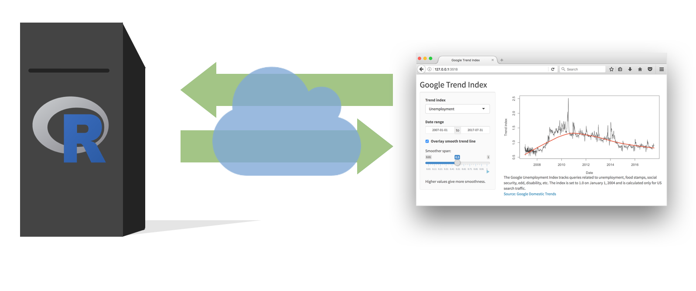
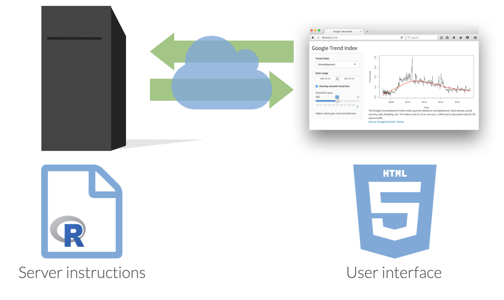

```{r setup, include=FALSE}
options(htmltools.dir.version = FALSE)
xaringanExtra::use_panelset()
library(countdown)
```

```{r xaringan-themer, include = FALSE, warning = FALSE, fig.showtext = FALSE}
library(xaringanthemer)
style_duo_accent(
  primary_color = "#866fa3", # purple
  secondary_color = "#F1DE67", # yellow
  inverse_header_color = "#464a53", # dark gray
  black_color = "#464a53",
  code_highlight_color = "#f1de67",
  header_font_google = google_font("Atkinson Hyperlegible"),
  text_font_google   = google_font("Atkinson Hyperlegible"),
  code_font_google   = google_font("Source Code Pro"),
  code_font_size = "20px",
  title_slide_background_color = "#FFFFFF",
  title_slide_background_image = "https://github.com/vizdata-f21/slides/raw/main/vizdata-bg.jpeg",
  title_slide_background_size = "contain",
  base_font_size = "24px",
  header_h1_font_size = "1.9rem",
  header_h2_font_size = "1.75rem",
  header_h3_font_size = "1.5rem",
  extra_css = list(
    "h1" = list("margin-block-start" = "0.4rem", 
                 "margin-block-end" = "0.4rem"),
    "h2" = list("margin-block-start" = "0.4rem", 
                 "margin-block-end" = "0.4rem"),
    "h3" = list("margin-block-start" = "0.4rem", 
                 "margin-block-end" = "0.4rem"),
    ".tiny" = list("font-size" = "50%"),
    ".xsmall" = list("font-size" = "72%"),
    ".small" = list("font-size" = "80%"),
    ".midi" = list("font-size" = "90%"),
    ".tiny .remark-code" = list("font-size" = "50%"),
    ".xsmall .remark-code" = list("font-size" = "72%"),
    ".small .remark-code" = list("font-size" = "80%"),
    ".midi .remark-code" = list("font-size" = "90%"),
    ".large" = list("font-size" = "200%"),
    ".huge" = list("font-size" = "400%",
                     "font-family" = "'Montserrat', sans-serif",
                     "font-weight" = "bold"),
    ".hand" = list("font-family" = "'Gochi Hand', cursive",
                   "font-size" = "125%"),
    ".task" = list("padding-right"    = "10px",
                   "padding-left"     = "10px",
                   "padding-top"      = "3px",
                   "padding-bottom"   = "3px",
                   "margin-bottom"    = "6px",
                   "margin-top"       = "6px",
                   "border-left"      = "solid 5px #F1DE67",
                   "background-color" = "#F1DE6750"),
    ".note" = list("padding-right"    = "10px",
               "padding-left"     = "10px",
               "padding-top"      = "3px",
               "padding-bottom"   = "3px",
               "margin-bottom"    = "6px",
               "margin-top"       = "6px",
               "border-left"      = "solid 5px #866fa3",
               "background-color" = "#866fa350"),
    ".pull-left" = list("width" = "49%",
                        "float" = "left"),
    ".pull-right" = list("width" = "49%",
                         "float" = "right"),
    ".pull-left-wide" = list("width" = "70%",
                             "float" = "left"),
    ".pull-right-narrow" = list("width" = "27%",
                                "float" = "right"),
    ".pull-left-narrow" = list("width" = "27%",
                               "float" = "left"),
    ".pull-right-wide" = list("width" = "70%",
                              "float" = "right"),
    ".blue" = list(color = "#2A9BB7"),
    ".purple" = list(color = "#a493ba"),
    ".yellow" = list(color = "#f1de67"),
    ".gray" = list(color = "#464a53")
    )
  )
```

class: middle, inverse

# Welcome

---

## Announcements

- Peer review of Project 2 proposals on Monday in lab

- HW 5 posted

---

## Setup

.midi[
```{r message = FALSE, warning = FALSE}
# load packages
library(tidyverse)
library(shiny)
library(gt)

# set default theme for ggplot2
ggplot2::theme_set(ggplot2::theme_minimal(base_size = 16))

# set default figure parameters for knitr
knitr::opts_chunk$set(
  fig.width = 8, fig.asp = 0.618, fig.retina = 3, dpi = 300, out.width = "60%"
)

# dplyr print min and max
options(dplyr.print_max = 10, dplyr.print_min = 10)
```
]

---

class: middle, inverse

# Shiny: High level view

---

class: middle, center

.center[
Every Shiny app has a webpage that the user visits, <br> and behind this webpage there is a computer that serves this webpage by running R.
]

```{r echo = FALSE, out.width = "80%"}
knitr::include_graphics("images/high-level-1.png")
```

---

class: middle, center

.center[
When running your app locally, the computer serving your app is your computer.
]

```{r echo = FALSE, out.width = "100%"}
knitr::include_graphics("images/high-level-2.png")
```

---

class: middle, center

.center[
When your app is deployed, the computer serving your app is a web server.
]

```{r echo = FALSE, out.width = "100%"}

```

---

class: middle, center

```{r echo = FALSE, out.width = "100%"}

```

---

.pull-left[
.task[
- Clone the `exercise-08` repo.
- Navigate to the `goog-index` folder, and launch the app by opening the `app.R` file and clicking on *Run App*.
- Close the app by clicking the stop icon
- Select view mode in the drop down menu next to Run App
]
]
.pull-right[
```{r echo = FALSE, fig.align = "center", out.width = "100%"}
knitr::include_app("https://gallery.shinyapps.io/goog-trend-index/", height = "650px")
```
]

---

class: middle, inverse

# Anatomy of a Shiny app

---

## What's in an app?

.pull-left[
```{r eval = FALSE}
library(shiny)
ui <- fluidPage()


server <- function(input, output) {}


shinyApp(ui = ui, server = server)
```
]
.pull-right[
- **User interface** controls the layout and appearance of app

- **Server function** contains instructions needed to build app
]

---

