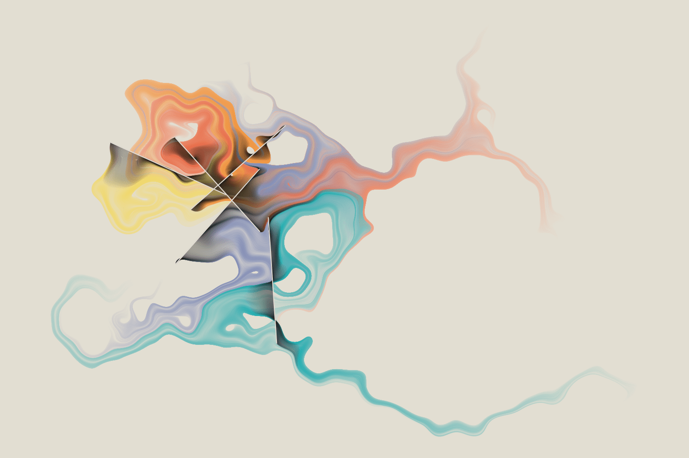
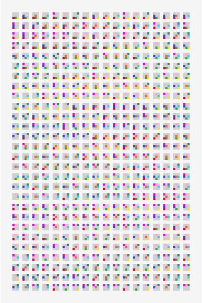
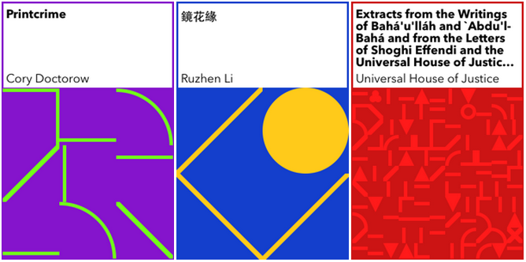

```{r setup, include=FALSE}
options(htmltools.dir.version = FALSE)
xaringanExtra::use_panelset()
library(countdown)
```

```{r xaringan-themer, include = FALSE, warning = FALSE, fig.showtext = FALSE}
library(xaringanthemer)
style_duo_accent(
  primary_color = "#866fa3", # purple
  secondary_color = "#F1DE67", # yellow
  inverse_header_color = "#464a53", # dark gray
  black_color = "#464a53",
  code_highlight_color = "#f1de67",
  header_font_google = google_font("Atkinson Hyperlegible"),
  text_font_google = google_font("Atkinson Hyperlegible"),
  code_font_google = google_font("Source Code Pro"),
  code_font_size = "20px",
  title_slide_background_color = "#FFFFFF",
  title_slide_background_image = "https://github.com/vizdata-f21/slides/raw/main/vizdata-bg.jpeg",
  title_slide_background_size = "contain",
  base_font_size = "24px",
  header_h1_font_size = "1.9rem",
  header_h2_font_size = "1.75rem",
  header_h3_font_size = "1.5rem",
  extra_css = list(
    "h1" = list(
      "margin-block-start" = "0.4rem",
      "margin-block-end" = "0.4rem"
    ),
    "h2" = list(
      "margin-block-start" = "0.4rem",
      "margin-block-end" = "0.4rem"
    ),
    "h3" = list(
      "margin-block-start" = "0.4rem",
      "margin-block-end" = "0.4rem"
    ),
    ".tiny" = list("font-size" = "50%"),
    ".xsmall" = list("font-size" = "72%"),
    ".small" = list("font-size" = "80%"),
    ".midi" = list("font-size" = "90%"),
    ".tiny .remark-code" = list("font-size" = "50%"),
    ".xsmall .remark-code" = list("font-size" = "72%"),
    ".small .remark-code" = list("font-size" = "80%"),
    ".midi .remark-code" = list("font-size" = "90%"),
    ".large" = list("font-size" = "200%"),
    ".huge" = list(
      "font-size" = "400%",
      "font-family" = "'Montserrat', sans-serif",
      "font-weight" = "bold"
    ),
    ".hand" = list(
      "font-family" = "'Gochi Hand', cursive",
      "font-size" = "125%"
    ),
    ".task" = list(
      "padding-right" = "10px",
      "padding-left" = "10px",
      "padding-top" = "3px",
      "padding-bottom" = "3px",
      "margin-bottom" = "6px",
      "margin-top" = "6px",
      "border-left" = "solid 5px #F1DE67",
      "background-color" = "#F1DE6750"
    ),
    ".note" = list(
      "padding-right" = "10px",
      "padding-left" = "10px",
      "padding-top" = "3px",
      "padding-bottom" = "3px",
      "margin-bottom" = "6px",
      "margin-top" = "6px",
      "border-left" = "solid 5px #866fa3",
      "background-color" = "#866fa350"
    ),
    ".pull-left" = list(
      "width" = "49%",
      "float" = "left"
    ),
    ".pull-right" = list(
      "width" = "49%",
      "float" = "right"
    ),
    ".pull-left-wide" = list(
      "width" = "70%",
      "float" = "left"
    ),
    ".pull-right-narrow" = list(
      "width" = "27%",
      "float" = "right"
    ),
    ".pull-left-narrow" = list(
      "width" = "27%",
      "float" = "left"
    ),
    ".pull-right-wide" = list(
      "width" = "70%",
      "float" = "right"
    ),
    ".blue" = list(color = "#2A9BB7"),
    ".purple" = list(color = "#a493ba"),
    ".yellow" = list(color = "#f1de67"),
    ".gray" = list(color = "#464a53")
  )
)
```

class: middle, inverse

# Welcome

---

## Announcements

- Dec 1: AMA with Thomas Lin Pedersen
  - Topic: Anything ggplot2 or data visualization
  - To prepare: Just keep doing what you're doing!
  - Add a question to sli.do by 11:30am on Dec 1: [sli.do](https://slido.com/) / #632366 (will be open Nov 25)

--
- Office hours for the week of Thanksgiving:
  - Mine: 3:30-4:30pm on Monday (virtual)
  - Vittorio: 2-3pm on Monday + 11am-12pm on Tuesday (both virtual)
  
- Office hours for last week of classes:
  - Vittorio: 2-3pm on Monday + 11am-12pm on Tuesday (both in person at Old Chem 203B)
  - Jennifer: 3-4pm on Wednesday and 5-6pm on Thursday (both virtual)
  - Mine: 3-4pm on Tuesday and 3:30-5pm on Thursday (both virtual)

--
- Remaining items due:
  - RQ 6 - Wed, 24 Nov
  - HW 6 - Mon, 29 Nov
  - Project 2 - Fri, 3 Dec

---

## Setup

.midi[
```{r message = FALSE, warning = FALSE}
# load packages
library(tidyverse)
library(scico)

# set default theme (use theme_gray)
ggplot2::theme_set(ggplot2::theme_gray(base_size = 16))

# set default figure parameters for knitr
knitr::opts_chunk$set(
  fig.width = 8, fig.asp = 0.618, fig.retina = 3, dpi = 300, out.width = "60%"
)

# dplyr print min and max
options(dplyr.print_max = 6, dplyr.print_min = 6)
```
]

---

class: middle, inverse

# Generative art

---

## Genesis 338

by Thomas Lin Pedersen

```{r echo = FALSE}

```

[More from Thomas Lin Pedersen](https://www.data-imaginist.com/art)

---

## Flametree

by Danielle Navarro

```{r echo = FALSE, out.width = "40%"}
knitr::include_graphics("images/flametree.png")
```

[More from Danielle Navarro](https://art.djnavarro.net/)

---

## Permutations

by Georgios Karamanis

```{r echo = FALSE, out.width = "25%"}

```

[More from Georgios Karamanis](https://karaman.is/)

---

## Abstractions

by Antonio Sánchez Chinchón

```{r echo = FALSE, out.width = "40%"}
knitr::include_graphics("images/abstractions.png")
```

[More from Antonio Sánchez Chinchón](https://fronkonstin.com/)

---

## Generative art: what

> One overly simple but useful definition is that generative art is art programmed using a computer that intentionally introduces randomness as part of its creation process.
>
>[Jason Bailey](https://www.artnome.com/news/2018/8/8/why-love-generative-art)

- There is randomness to the art, introduced by the computer (the code)
- The artist has control over the randomness, as contradictory as that may sound

---

## Generative art: why

- Why people create generative art pieces?
  - Artistic expression
  - Leveraging computers to generate randomness
  - ...

--
- Why are we learning about generative art?
  - A different look at data visualization: not for the meaning in the data, but for the visual itself
  - Great way to practice programming, particularly if you're into creating art
  - Opportunity to practice problem solving skills, particularly if you're sketching first, then creating or reproducing an existing piece

---

## Generative art in use: Book covers

Just one of many examples of generative art as a practical solution by the New York Public Library:

To fill in missing book covers in an ebook-borrowing and reading app 

```{r echo = FALSE}

```

.footnote[
New York Public Library, [Generative eBook Covers](https://www.nypl.org/blog/2014/09/03/generative-ebook-covers). September 3, 2014.
]

---

class: middle, inverse

# Flowers in the (plot) window

---

## Let's make a circle

.pull-left[
```{r circle-points, fig.show = "hide"}
# make a circle of points
t <- seq(0, 2 * pi, length.out = 50)
x <- sin(t)
y <- cos(t)
df <- tibble(t, x, y)

# plot a circle of points
ggplot(df, aes(x, y)) +
  geom_point() +
  coord_equal()
```
]
.pull-right[
```{r ref.label = "circle-points", echo = FALSE, fig.asp = 1, out.width = "100%"}

```
]

---

## The Golden Angle

.pull-left[
The golden angle is the angle subtended by the smaller (red) arc when two arcs that make up a circle are in the golden ratio.

$$ \pi(3 − \sqrt{5}) $$

```{r echo = FALSE, fig.asp = 1, out.width = "50%", fig.align = "center"}
knitr::include_graphics("images/Golden_Angle.png")
```
]
--
.pull-right[
The golden angle is the angle separating successive florets on a sunflower.

```{r echo = FALSE, fig.asp = 1, out.width = "50%", fig.align = "center"}
knitr::include_graphics("images/Goldener_Schnitt_Blattstand.png")
```
]

.footnote[
Wikipedia. [Golden angle](https://en.wikipedia.org/wiki/Golden_angle).
]

---

## Petals with the golden angle

.pull-left[
```{r golden-paths, fig.show = "hide"}
# set golden angle
angle <- pi * (3 - sqrt(5))

# set number of points
points <- 50

# make data frame
df <- tibble(
  i = 1:points,
  t = (1:points) * angle,
  x = sin(t),
  y = cos(t)
)

# plot points in a spiral
ggplot(df, aes(x = x * t, y = y * t)) +
  geom_path(color = "gray") +
  geom_text(aes(label = i)) +
  coord_equal()
```
]
.pull-right[
```{r ref.label = "golden-paths", echo = FALSE, fig.asp = 1, out.width = "100%"}

```
]

---

## Paths to points

.pull-left[
```{r golden-points, fig.show = "hide"}
# set golden angle
angle <- pi * (3 - sqrt(5))

# set number of points
points <- 50

# make data frame
df <- tibble(
  i = 1:points,
  t = (1:points) * angle,
  x = sin(t),
  y = cos(t)
)

# plot points in a spiral
ggplot(df, aes(x = x * t, y = y * t)) +
  geom_point() + #<<
  coord_equal()
```
]
.pull-right[
```{r ref.label = "golden-points", echo = FALSE, fig.asp = 1, out.width = "100%"}

```
]

---

## Without the background

.pull-left[
```{r golden-points-void, fig.show = "hide"}
# set golden angle
angle <- pi * (3 - sqrt(5))

# set number of points
points <- 50

# make data frame
df <- tibble(
  i = 1:points,
  t = (1:points) * angle,
  x = sin(t),
  y = cos(t)
)

# plot points in a spiral
ggplot(df, aes(x = x * t, y = y * t)) +
  geom_point() +
  coord_equal() +
  theme_void() #<<
```
]
.pull-right[
```{r ref.label = "golden-points-void", echo = FALSE, fig.asp = 1, out.width = "100%"}

```
]

---

## More points

.pull-left[
```{r golden-points-more-void, fig.show = "hide"}
# set golden angle
angle <- pi * (3 - sqrt(5))

# set number of points
points <- 100 #<<

# make data frame
df <- tibble(
  i = 1:points,
  t = (1:points) * angle,
  x = sin(t),
  y = cos(t)
)

# plot points in a spiral
ggplot(df, aes(x = x * t, y = y * t)) +
  geom_point() +
  coord_equal() +
  theme_void()
```
]
.pull-right[
```{r ref.label = "golden-points-more-void", echo = FALSE, fig.asp = 1, out.width = "100%"}

```
]

---

## Adjust points

.pull-left[
```{r golden-points-more-void-adjust, fig.show = "hide"}
# set golden angle
angle <- pi * (3 - sqrt(5))

# set number of points
points <- 100

# make data frame
df <- tibble(
  i = 1:points,
  t = (1:points) * angle + 20, #<<
  x = sin(t),
  y = cos(t)
)

# plot points in a spiral
ggplot(df, aes(x = x * t, y = y * t)) +
  geom_point() +
  coord_equal() +
  theme_void()
```
]
.pull-right[
```{r ref.label = "golden-points-more-void-adjust", echo = FALSE, fig.asp = 1, out.width = "100%"}

```
]

---

class: middle, inverse

# Formalize a system

---

## Write a function: `build_art()`

```{r}
build_art <- function() {

  # set golden angle
  angle <- pi * (3 - sqrt(5))

  # set number of points
  points <- 100

  # make data frame
  tibble(
    i = 1:points,
    t = (1:points) * angle + 20,
    x = sin(t),
    y = cos(t)
  )
}
```

---

## Add arguments to `build_art()`

.pull-left[
```{r}
build_art <- function(points,
                      angle,
                      adjustment) {
  tibble(
    i = 1:points,
    t = (1:points) * angle + adjustment,
    x = sin(t),
    y = cos(t)
  )
}
```
]
.pull-right[
```{r}
build_art(
  angle = pi * (3 - sqrt(5)),
  points = 100,
  adjustment = 20
)
```
]

---

## Use the function

.pull-left[
```{r points-100, fig.show = "hide"}
build_art(
  angle = pi * (3 - sqrt(5)),
  points = 100,
  adjustment = 20
) %>%
  ggplot(aes(x = x * t, y = y * t)) +
  geom_point() +
  coord_equal() +
  theme_void()
```
]
.pull-right[
```{r ref.label = "points-100", echo = FALSE, out.width = "100%", fig.asp = 1}

```
]

---

## Change parameters

.pull-left[
```{r points-500, fig.show = "hide"}
build_art(
  angle = 3, #<<
  points = 500, #<<
  adjustment = 0 #<<
) %>%
  ggplot(aes(x = x * t, y = y * t)) +
  geom_point() +
  coord_equal() +
  theme_void()
```
]
.pull-right[
```{r ref.label = "points-500", echo = FALSE, out.width = "100%", fig.asp = 1}

```
]

---

## Next steps...

- Add random noise
- Add more customization options
  - Size
  - Color
  - Shape
  - ...

---

class: middle, large

.hand[livecoding...]

(Code developed will be posted here after class)

---

class: middle, inverse

# Wrap up

---

## Acknowledgements

- [Unpredictable paintings](https://blog.djnavarro.net/posts/2021-11-01_unpredictable-paintings/) by Danielle Navarro

- [Drawing Flowers with R and ggplot2](https://roweyerboat.github.io/drawing_flowers_with_r_and_ggplot2) by Amanda Rowe

- [Generative Art and R](https://generative.substack.com/p/generative-art-and-r) by the Generative Arts Collective

- [Getting Started with Generative Art in R](https://towardsdatascience.com/getting-started-with-generative-art-in-r-3bc50067d34b)

- [Why Love Generative Art?](https://www.artnome.com/news/2018/8/8/why-love-generative-art) by Jason Bailey

---

## Learn/do more

- R packages:
  - [aRtsy](https://koenderks.github.io/aRtsy/) by Koen Derks
  - [generativeart](https://github.com/cutterkom/generativeart) by Katharina Brunner
  - [flametree](https://flametree.djnavarro.net/) and [jasmines](https://jasmines.djnavarro.net/) bu Danielle Navarro
  - [ambient](https://ambient.data-imaginist.com/) and [particles](https://github.com/thomasp85/particles) by Thomas Lin Pedersen

- More aRtists: [rtistry art gallery](https://ijeamaka-a.shinyapps.io/rtistry_gallery/) by Ijeamaka Anyene

- Community: [Recreation Thursday](https://github.com/sharlagelfand/RecreationThursday) - [#RecreationThursday](https://twitter.com/search?q=%23RecreationThursday&src=typed_query&f=live) is a summer social project for data visualization folks to recreate and remix existing art pieces through any medium of their choosing - through code, painting, music, embroidery, whatever! Our goal is to get creativity flowing and most importantly to have fun!
