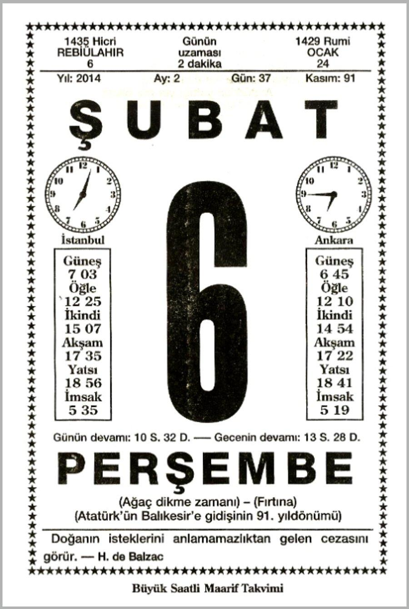
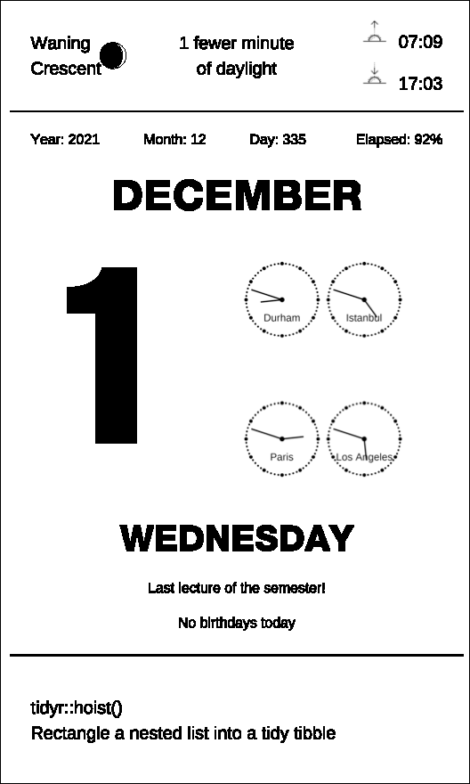
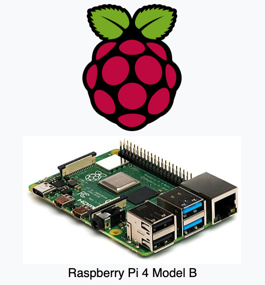

```{r setup, include=FALSE}
options(htmltools.dir.version = FALSE)
xaringanExtra::use_panelset()
library(countdown)
```

```{r xaringan-themer, include = FALSE, warning = FALSE, fig.showtext = FALSE}
library(xaringanthemer)
style_duo_accent(
  primary_color = "#866fa3", # purple
  secondary_color = "#F1DE67", # yellow
  inverse_header_color = "#464a53", # dark gray
  black_color = "#464a53",
  code_highlight_color = "#f1de67",
  header_font_google = google_font("Atkinson Hyperlegible"),
  text_font_google = google_font("Atkinson Hyperlegible"),
  code_font_google = google_font("Source Code Pro"),
  code_font_size = "20px",
  title_slide_background_color = "#FFFFFF",
  title_slide_background_image = "https://github.com/vizdata-f21/slides/raw/main/vizdata-bg.jpeg",
  title_slide_background_size = "contain",
  base_font_size = "24px",
  header_h1_font_size = "1.9rem",
  header_h2_font_size = "1.75rem",
  header_h3_font_size = "1.5rem",
  extra_css = list(
    "h1" = list(
      "margin-block-start" = "0.4rem",
      "margin-block-end" = "0.4rem"
    ),
    "h2" = list(
      "margin-block-start" = "0.4rem",
      "margin-block-end" = "0.4rem"
    ),
    "h3" = list(
      "margin-block-start" = "0.4rem",
      "margin-block-end" = "0.4rem"
    ),
    ".tiny" = list("font-size" = "50%"),
    ".xsmall" = list("font-size" = "72%"),
    ".small" = list("font-size" = "80%"),
    ".midi" = list("font-size" = "90%"),
    ".tiny .remark-code" = list("font-size" = "50%"),
    ".xsmall .remark-code" = list("font-size" = "72%"),
    ".small .remark-code" = list("font-size" = "80%"),
    ".midi .remark-code" = list("font-size" = "90%"),
    ".large" = list("font-size" = "200%"),
    ".huge" = list(
      "font-size" = "400%",
      "font-family" = "'Montserrat', sans-serif",
      "font-weight" = "bold"
    ),
    ".hand" = list(
      "font-family" = "'Gochi Hand', cursive",
      "font-size" = "125%"
    ),
    ".task" = list(
      "padding-right" = "10px",
      "padding-left" = "10px",
      "padding-top" = "3px",
      "padding-bottom" = "3px",
      "margin-bottom" = "6px",
      "margin-top" = "6px",
      "border-left" = "solid 5px #F1DE67",
      "background-color" = "#F1DE6750"
    ),
    ".note" = list(
      "padding-right" = "10px",
      "padding-left" = "10px",
      "padding-top" = "3px",
      "padding-bottom" = "3px",
      "margin-bottom" = "6px",
      "margin-top" = "6px",
      "border-left" = "solid 5px #866fa3",
      "background-color" = "#866fa350"
    ),
    ".pull-left" = list(
      "width" = "49%",
      "float" = "left"
    ),
    ".pull-right" = list(
      "width" = "49%",
      "float" = "right"
    ),
    ".pull-left-wide" = list(
      "width" = "70%",
      "float" = "left"
    ),
    ".pull-right-narrow" = list(
      "width" = "27%",
      "float" = "right"
    ),
    ".pull-left-narrow" = list(
      "width" = "27%",
      "float" = "left"
    ),
    ".pull-right-wide" = list(
      "width" = "70%",
      "float" = "right"
    ),
    ".blue" = list(color = "#2A9BB7"),
    ".purple" = list(color = "#a493ba"),
    ".yellow" = list(color = "#f1de67"),
    ".gray" = list(color = "#464a53")
  )
)
```

class: middle, inverse

# Welcome

---

## Announcements

- Project presentations on Friday
  - Presentation order to be announced in class on Friday
  - We might run over by a few minutes
  - Bring laptops, submit evaluations during presentations

--
- Remaining office hours:
  - Jennifer: 3-4pm on Wednesday and 5-6pm on Thursday (both virtual)
  - Mine: 3:30-5pm on Thursday (virtual)

--
- Remaining to do items:
  - Project 2
  - Peer evaluations (by 5pm on Friday)

--
- Course and TA evaluations (let's take some time now)

---

class: middle, inverse

# Workshop and peer review

---

class: middle

.task[
Any questions / things I can clarify about the projects or anything else we have covered so far?
]

---

## Peer review - Round 1

- Sit with your team
- Review the project homepage of one of the teams whose repo you have access to
- Open at least 1 issue providing feedback on something you like
- Open at least 1 issue providing a suggestion for improvement

```{r echo = FALSE}
countdown(minutes = 5)
```

---

## Peer review - Round 2

- Sit with your team
- Review the project homepage of one of the teams whose repo you have access to
- Open at least 1 issue providing feedback on something you like
- Open at least 1 issue providing a suggestion for improvement

```{r echo = FALSE}
countdown(minutes = 5)
```

---

## Peer review - Reflection

- Read the issues opened on your repos
- Close the issue with positive feedback with a thank you
- Make a plan for addressing the issue with constructive feedback (or, if minor, handle it now and close with a commit)

```{r echo = FALSE}
countdown(minutes = 5)
```

---

class: middle, inverse

# My project: Saatli Maarif Takvimi

---

## Saatli Maarif Takvimi

.pull-left[
```{r echo = FALSE, out.width = "70%", fig.align = "center"}

```
]
--
.pull-right[
```{r echo = FALSE, out.width = "80%", fig.align = "center"}
knitr::include_graphics("images/anane.png")
```
]

---

## Saatli Maarif Takvimi, reimagined

```{r echo = FALSE, out.width = "30%", fig.align = "center"}

```

---

## Sun and moon

- Use the [**suncalc**](https://github.com/datastorm-open/suncalc) package to calculate sunlight phases (times for sunrise, sunset, dusk, etc.) and lunar phase for the given location and time

- Use the [**gggibbous**](https://github.com/mnbram/gggibbous) package to draw the moon

---

## Sun

```{r}
lat_durham <- 35.9940
lon_durham <- -78.8986
sun_stuff_today <- suncalc::getSunlightTimes(date = Sys.Date(), lat = lat_durham, lon = lon_durham, tz = "EST")
sun_stuff_today

# sunrise
format(sun_stuff_today$sunrise, "%H:%M")
```

---

## Moon phase

```{r}
moon_stuff_today <- suncalc::getMoonIllumination(date = Sys.Date())
moon_stuff_today
moon_ratio <- moon_stuff_today$fraction
```

---

## Moon chart

```{r message = FALSE}
library(tidyverse)
library(gggibbous)
ggplot() +
  geom_moon(aes(x = 0.2, y = 0.98, ratio = 1), fill = "black", size = 50) +
  geom_moon(aes(x = 0.2, y = 0.98, ratio = moon_ratio), size = 50) +
  theme_void()
```

---

## Clock face

.xsmall[
```{r message = FALSE}
library(lubridate)

draw_clock <- function(tzone = "America/New_York", city = "Durham"){

  # create tibble
  minutes <- tibble(x = 0:60, y = 1)
  hours <- filter(minutes, x %% 5 == 0)

  # determine now
  now <- now(tzone = tzone)

  # find time now
  min_now <- minute(now)

  if(hour(now) >= 12){
    hour_now <- (hour(now) - 12)*5 + min_now/60*5
  } else {
    hour_now <- hour(now)*5 + min_now/60*5
  }

  ggplot() +
    geom_point(data = minutes, aes(x = x, y = y), size = 1) +
    geom_point(data = hours, aes(x = x, y = y), size = 3, show.legend = FALSE) +
    geom_point(aes(x = 0, y = 0), size = 3) +
    coord_polar() +
    expand_limits(y = c(0, 1)) +
    theme_void() +
    theme(
      axis.ticks = element_blank(),
      axis.text.y = element_blank(),
    ) +
    geom_segment(aes(x = hour_now, xend = hour_now, y = 0, yend = 0.6), size = 1) +
    geom_segment(aes(x = min_now, xend = min_now, y = 0, yend = 0.9), size = 1) +
    annotate(geom = "text", x = 30, y = 0.5, label = city, size = 18)
}
```
]

---

## Clocks around the world

```{r out.width = "25%", fig.show = "hold"}
draw_clock()
draw_clock(tzone = "Europe/Istanbul", city = "Istanbul")
draw_clock(tzone = "Europe/Paris", city = "Paris")
draw_clock(tzone = "America/Los_Angeles", city = "Los Angeles")
```

---

## Function of the day

Pending improvements: create `funs` based on a given list of packages and all of their functions.

```{r}
library(glue)

funs <- tribble(
  ~pkg, ~fun, ~description,
  "dplyr", "summarise", "Summarise each group to fewer rows",
  "tidyr", "hoist", "Rectangle a nested list into a tidy tibble",
  "ggplot2", "geom_spoke", "Line segments parameterised by location, direction and distance"
)

function_text <- funs %>%
  slice_sample(n = 1) %>%
  mutate(text = glue("{pkg}::{fun}()\n{description}")) %>%
  pull(text)

function_text
```

---

## Putting it altogether with ggplot2

See the full code at https://github.com/mine-cetinkaya-rundel/saatli-maarif/blob/main/saatli-maarif.R.

---

## Raspberry Pi

.pull-left[
The Raspberry Pi is a low cost, credit-card sized computer that plugs into a computer monitor or TV, and uses a standard keyboard and mouse.
]
.pull-right[
```{r echo = FALSE, out.width = "80%", fig.align = "center"}

```
]

.footnote[
Image from https://en.wikipedia.org/wiki/Raspberry_Pi
]

---

## Saatli Maarif Takvimi on Raspberri pi

```{r echo = FALSE, out.width = "65%", fig.align = "center"}
knitr::include_graphics("images/smt-on-rp.png")
```

--
.hand[and the video...]

---

## It takes a ~~village~~ team

- See https://github.com/rundel/saatli_maarif for all the pieces for getting the image on the Raspberry Pi (thanks Colin Rundel!)

- Tools used: R for creating the graphic, Python for communicating with the e-Paper display (reading the output image and writing to the display)

---

class: middle, inverse

# AMA with Thomas Lin Pedersen

---

class: middle, inverse

# THANK YOU!
